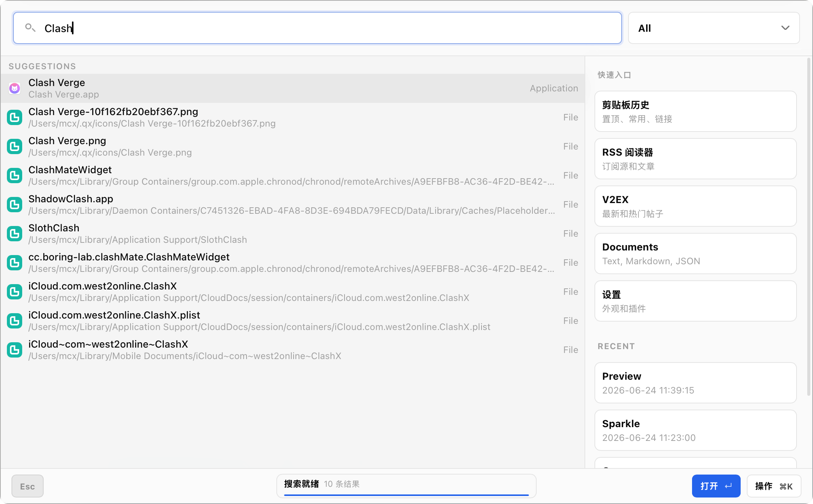
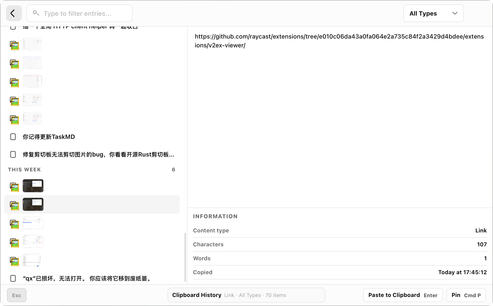
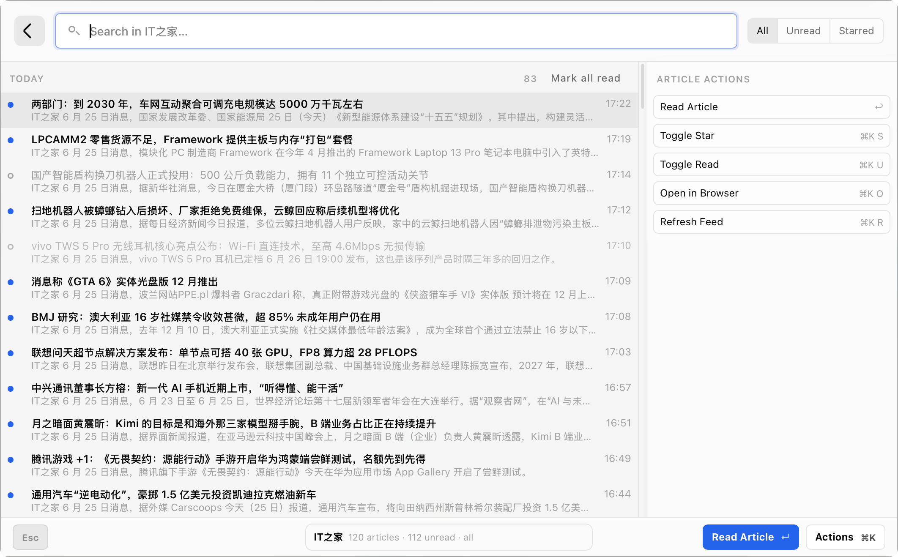

# Qx — macOS Productivity Launcher


**English** | [中文](#qx--macos-效率启动器)

Qx is a **menu-bar resident desktop launcher** for macOS, inspired by Raycast. It pops up with a global hotkey, giving you instant access to search, clipboard history, screen recording (GIF), RSS feeds, AI chat, V2EX browsing, macros, and more — all within a unified, keyboard-first interface.


Built with **Tauri v2**, **React 19**, **TypeScript**, and **Rust**. It uses the macOS native frosted-glass appearance, Mach kernel APIs for system stats, and vendored native search for fast file lookups.

> **Status**: v0.4.61 — active development

---

## Features

| Module | Description |
|--------|-------------|
| **Launcher** | Fuzzy-search installed apps, files, built-in commands, plugin actions, and user aliases/tags |
| **Clipboard** | Persisted clipboard history with text/image support, pinning, filtering, inline preview |
| **Screen Recording** | Region-based GIF recording at 15fps (gifski), auto-saves to history |
| **RSS Reader** | Add feeds, inline article reading, star/bookmark, OPML import/export, background auto-refresh |
| **Weather** | Real-time weather display with location auto-detection, provider config, caching for instant launch, and background refresh |
| **QxAI** | Built-in AI chat assistant with multi-provider support (DuckDuckGo, BYOK OpenAI-compatible), streaming responses, persistent memory, and per-conversation model switching |
| **V2EX** | Browse and search v2ex.com topics (latest/hot), read articles inline with HTML sanitization, node-based filtering |
| **Macros** | Record and replay keyboard/mouse macro sequences |
| **Dev Tools** | Text / JSON / Markdown utility tools |
| **GitHub Calendar** | View your GitHub contribution graph inline |
| **OCR** | Optical character recognition model management for extracting text from images |
| **Plugin System** | Sandboxed iframe-based plugin runtime with RPC bridge, marketplace, archive import, ed25519 signature verification, Raycast extension conversion, and `context.ai` SDK for plugin AI capabilities |
| **AI Agent Settings** | Configure AI agent mode, default provider/model, tool toggles (bash, grep, memory, MCP, background tasks), and bash/grep execution parameters |
| **Weather Settings** | Configure weather provider (Open-Meteo / OpenWeatherMap), location override, and auto-refresh interval |
| **OCR Settings** | Download and manage OCR recognition models (languages, versions) |
| **Settings** | General, appearance (light/dark/system theme with Geist design system), keyboard shortcuts, macOS permissions, plugin management |

---

## Technology Stack

| Layer | Technology |
|-------|-----------|
| **Desktop Shell** | [Tauri v2](https://v2.tauri.app) (macOS private API, tray icon, frosted glass) |
| **Frontend** | React 19 + TypeScript + Vite 7 |
| **Styling** | Tailwind CSS v4 + CSS custom properties (Geist-inspired 10-step design tokens) |
| **State** | Zustand (global, plugin registry, per-module stores) |
| **Animation** | Framer Motion v12 |
| **Backend** | Rust (async via tokio, Tauri commands) |
| **Database** | SQLite via rusqlite (apps cache, clipboard history, RSS, plugin data) |
| **AI Runtime** | Multi-provider chat (DuckDuckGo, custom OpenAI-compatible), streaming, agent tool-calling with gating |
| **i18n** | English / Simplified Chinese |
| **Plugin Runtime** | Sandboxed iframe + postMessage RPC bridge with `context.ai` SDK |

### Rust Dependencies (key)

| Crate | Purpose |
|-------|---------|
| `xcap` | Display enumeration helpers |
| `scrap` + `gifski` | Screen recording → GIF encoding |
| `rdev` + `enigo` | Macro record/replay |
| `feed-rs` | RSS/Atom parsing |
| `reqwest` | HTTP client (RSS fetch, marketplace, GitHub API, AI provider requests) |
| `rusqlite` | App data persistence |
| `battery` | Battery / power status |
| `objc2` / `core-graphics` | macOS native APIs |
| `window-vibrancy` | Frosted glass effect |
| `ed25519-dalek` | Plugin signature verification |

---

## Architecture

```
┌──────────────────────────────────────────────────────────┐
│                    Tauri v2 Shell                         │
│  ┌────────────────────────────────────────────────────┐  │
│  │              React 19 + TypeScript                  │  │
│  │  ┌──────────┐ ┌──────────┐ ┌──────────────────┐   │  │
│  │  │ Launcher │ │ Clipboard│ │ RSS / V2EX /      │   │  │
│  │  │ (search) │ │ History  │ │ QxAI / Settings   │   │  │
│  │  └──────────┘ └──────────┘ └──────────────────┘   │  │
│  │  ┌──────────────────────────────────────────────┐  │  │
│  │  │  Plugin System (iframe sandbox + RPC bridge) │  │  │
│  │  │  + context.ai SDK (chat, stream, bash,       │  │  │
│  │  │    memory, grep, background tasks)            │  │  │
│  │  └──────────────────────────────────────────────┘  │  │
│  └────────────────────────────────────────────────────┘  │
│  ┌────────────────────────────────────────────────────┐  │
│  │              Rust Backend (Tauri Commands)          │  │
│  │  apps  |  clipboard  |  screencap   |  rss          │  │
│  │  g4f   |  plugin_api |  settings    |  system_      │  │
│  │        |             |              |  stats        │  │
│  │  system_  |  weather  |  floating_ |  apps_zh_     │  │
│  │  information  |       |  panel     |  dict         │  │
│  │  macros | file_search | history | ocr | github_    │  │
│  │        |             |         |     | calendar     │  │
│  │  v2ex  | storage | permissions | http_client |     │  │
│  └────────────────────────────────────────────────────┘  │
└──────────────────────────────────────────────────────────┘
```

### Shell Layout

```
┌──────────────────────────────────────────────┐
│ Top Bar: Back + Search + Quick Actions       │
├──────────────────────────────────────────────┤
│ Main Area (content)       │ Context Panel    │
│                           │ (240–340px)      │
├──────────────────────────────────────────────┤
│ Esc      [ Dynamic Island ]          Actions │
└──────────────────────────────────────────────┘
```

The Dynamic Island is always centered via `position: absolute; left: 50%; transform: translateX(-50%)`. Three visual styles are available: `solid`, `elevated`, and `glass`. The island supports idle modes (system info, date display with lunar calendar and LED matrix clock), notice, progress, activity, playback, and error states with marquee scrolling.

---

## Screenshots

> *Screenshots to be added.*

| View | Preview |
|------|---------|
| Launcher + Search Results |  |
| Clipboard History |  |
| RSS Reader |  |
| Settings — Appearance | `<!-- screenshot -->` |

---


## Installation

### Homebrew (recommended)

```bash
brew tap mcxen/qx
brew install --cask qx
```

> **Note for users in China**: If GitHub is inaccessible, use SSH: `git clone git@github.com:mcxen/homebrew-qx.git /opt/homebrew/Library/Taps/mcxen/homebrew-qx`

### Manual

1. Download `qx_<version>_aarch64-apple-darwin.app.zip` from [Releases](https://github.com/mcxen/qx/releases)
2. Unzip and move `Qx.app` to `/Applications`
3. Right-click → Open (first launch needs Gatekeeper override)
4. Qx lives in the menu bar — click the icon or press the global hotkey to open

### Update

```bash
brew update
brew upgrade --cask qx
```

---

## Usage

### Global Hotkey

| Action | Default Shortcut |
|--------|-----------------|
| Toggle Qx window | `⌘Space` (configurable in Settings → Shortcuts) |

### Launcher

Type anything into the search bar. Results include:

- **Apps** — fuzzy-matched from LaunchServices DB
- **Files** — native file search (kMDQuery)
- **Commands** — `settings`, `clipboard`, `rss`, `gif`, `macro`, `qxai`, `v2ex`, `weather`, `ocr`
- **Calculator** — inline expression evaluation (`42 * 3.14`, `sqrt(144)`)
- **Plugin commands** — from installed plugins

### Keyboard Navigation

| Key | Action |
|-----|--------|
| `↑` / `↓` | Navigate results |
| `Enter` | Select / confirm |
| `Esc` | 3-level cascade: close detail → clear search → back to launcher |
| `⌘K` | Open Actions menu for current selection |
| `⌘,` | Open Settings |
| `⌘P` | Toggle pin (clipboard) |
| `⌘⌫` | Delete current entry |

### Modules

**Clipboard** — every copy is saved automatically. Open via `⌘⇧V` or search `clipboard`. Supports text, images, pinning, and type filtering.

**Screen Recording** — search `gif` / `screencap`. Region-select and record up to 180s. Output is auto-encoded to animated GIF via gifski.

**RSS Reader** — search `rss`. Add feeds by URL, read articles inline with a detail pane, star to bookmark. Supports OPML import/export.

**QxAI** — search `qxai`. Built-in AI chat assistant supporting multi-turn conversations with streaming responses. Configure providers in Settings → QxAI: the built-in DuckDuckGo provider works out of the box; add custom OpenAI-compatible providers (BYOK) with auto-fetched model lists. Each conversation can switch provider/model independently. Persistent memory stores user preferences accessible to both QxAI and plugins.

**V2EX** — search `v2ex`. Browse v2ex.com topics in latest or hot mode, search by keyword, and read articles with rendered HTML inline. Configure a V2EX API token and favorite nodes in the module preferences for extended features.

**Weather** — search `weather`. Real-time weather display with provider config (Open-Meteo / OpenWeatherMap), location auto-detection, and caching for instant launch. Configure in Settings → Weather.

**OCR** — search `ocr`. Download and manage OCR recognition models for extracting text from images. Configure languages and model versions in Settings → OCR.

**Macros** — search `macro`. Record keyboard/mouse sequences and replay them. Saved macros persist in history.

**Settings** — search `settings` or press `⌘,`. Configure theme, shortcuts, RSS, Weather, OCR, plugins, AI agent, and advanced options across 11 settings panels.

**AI Agent** — open Settings → AI Agent to configure the AI agent runtime: enable/disable agent mode, set default provider and model, and toggle tool groups including bash execution, grep search, memory, app/file search, HTTP fetch, MCP, notifications, and background tasks. Bash and grep have additional configuration for working directory, timeout, search root, and result limits. These settings gate plugin `context.ai` tool access at runtime.

**Permissions** — open Settings → Permissions to check macOS Screen Recording, Accessibility, and Input Monitoring access. Green means Qx already has access; red means the feature needs approval. Use Request/Open to jump to the right System Settings privacy pane, then refresh the status after changing access.

**Plugins** — open Settings → Extensions to manage installed plugins, browse the marketplace, or import a plugin archive. Installed supports search and `All / Built-in / External / Enabled / Disabled` filtering, with details showing version, path, permissions, preferences, display options, and SHA256 on the right. Browse shows marketplace search results with metadata and install status. Qx accepts local `.zip` / `.qx-plugin` packages, GitHub repository URLs, direct GitHub archive URLs such as release assets or `https://github.com/<owner>/<repo>/archive/refs/heads/main.zip`, and Raycast extension tree URLs. Repository URLs are downloaded as the `main` branch archive. The archive may contain the plugin at the zip root or inside a GitHub-generated top-level folder; Qx locates `manifest.json`, installs that plugin root into `~/.qx/plugins/<plugin-id>`, verifies ed25519 signatures when present, and enables the plugin automatically. Converted Raycast ActionPanel buttons can be shown or hidden from Extensions → Installed → Display, and are hidden first when a plugin panel is narrow.

---

## Plugin System

Plugins are sandboxed JavaScript modules running in iframes that communicate with the host via `postMessage` RPC. Each plugin declares its capabilities in a `manifest.json` and requests permissions for protected APIs.

### Plugin AI SDK (`context.ai`)

Plugins declaring the `ai` permission gain access to a rich AI SDK:

| API | Permission | Description |
|-----|-----------|-------------|
| `ai.providers()` | `ai` | List available AI providers |
| `ai.models(provider?)` | `ai` | List models for a provider |
| `ai.defaultModel()` | `ai` | Get user's default provider/model |
| `ai.agentSettings()` | `ai` | Get agent runtime configuration |
| `ai.chat(input, options?)` | `ai` | Synchronous AI completion (string, messages, or multimodal) |
| `ai.stream(input, onChunk, options?)` | `ai` | Streaming AI output with chunk callback |
| `ai.runBash(script, options?)` | `ai-bash` | Execute bash with cwd and timeout |
| `ai.memory.list()` | `ai-memory` | List persistent memory entries |
| `ai.memory.add(text, tags?)` | `ai-memory` | Add a memory entry |
| `ai.memory.delete(id)` | `ai-memory` | Delete a memory entry |
| `ai.search.grep(query, options?)` | `ai-tools` | Grep-style code/file search |
| `ai.tasks.submit(input)` | `ai` + `ai-background` | Submit a background AI task |
| `ai.tasks.list()` | `ai-background` | List plugin's background tasks |
| `ai.tasks.get(id)` | `ai-background` | Get task status/result |
| `ai.tasks.cancel(id)` | `ai-background` | Cancel a running task |

AI chat supports string prompts, message arrays, OpenAI-compatible content parts, and `images` (base64 with detail control). Tool calls are gated by both plugin permissions and the AI Agent Settings toggles at runtime.

### Plugin Security

- Plugins run in sandboxed iframes (`allow-scripts` only, no `allow-same-origin`).
- Permission-based access control — every RPC call is checked against the plugin's declared permissions.
- Dangerous commands (file deletion, system modification, etc.) require exact `invoke:<command>` permission.
- Agent tools (bash, memory, grep, background tasks) require both plugin permissions and runtime agent settings to be enabled.
- Plugin packages may include `pubkey` and `signature` for ed25519 verification at install time.

### Raycast Extension Compatibility

Qx includes a conversion script (`scripts/convert-raycast-extension.mjs`) that transforms Raycast extension directories into Qx plugins. Paste a GitHub Raycast extension tree URL into the plugin manager to trigger automatic conversion and installation.

---

## Development

### Prerequisites

- [Rust](https://rustup.rs) (edition 2021)
- Node.js ≥ 20
- macOS 14+ (for Tauri v2 + macOS private APIs)

### Setup

```bash
git clone https://github.com/mcxen/qx.git
cd qx
npm install
```

### Development

```bash
npm run tauri dev
```

This starts a Vite dev server on `:1420` and opens a Tauri window.

### Build for Distribution

```bash
npm run tauri build -- --target aarch64-apple-darwin --bundles app
```

### Validation

```bash
cd src-tauri && cargo check
npx tsc --noEmit
```

---

## Project Structure

```
src/                          # Frontend (React + TypeScript)
├── App.tsx                   # Root component + tab routing
├── App.css                   # Global styles + CSS variable references
├── store.ts                  # Global Zustand store
├── ThemeProvider.tsx         # Light/dark/system theme provider
├── i18n.ts                   # EN / zh-CN translations
├── Launcher.tsx              # Main launcher with search + results
├── modules/                  # Feature modules
│   ├── clipboard/            # Clipboard history panel
│   ├── rss/                  # RSS reader (list + detail + store)
│   ├── qx-ai/               # AI chat assistant (chat + settings + store)
│   ├── v2ex/                # V2EX forum viewer (panel + detail)
│   ├── settings/            # Settings (11 sub-panels + store)
│   ├── screencap/           # Screen recorder + GIF history
│   ├── macros/              # Macro recorder + replayer
│   ├── weather/             # Weather display panel
│   ├── documents/           # Dev text/JSON/MD tools
│   └── github-calendar/     # GitHub contributions viewer
├── launcher/                 # Launcher sub-modules
│   ├── LauncherContext.tsx   # Right-side context panel (quick entries, history)
│   ├── LauncherActionPopover.tsx # Floating action menu for selected item
│   ├── launcherActions.ts   # Context-sensitive action factory
│   └── useLauncherHistory.ts # Launch + search history hook
├── plugin/                   # Plugin system
│   ├── types.ts              # Plugin manifest/command/panel/AI SDK types
│   ├── registry.ts           # Zustand registry + topological sort
│   ├── runtime.ts            # iframe sandbox + RPC bridge + context.ai
│   ├── builtin.ts            # Built-in modules as pseudo-plugins
│   └── PluginHost.tsx        # iframe container + panel viewport
├── components/               # Shared components
│   ├── QxShell.tsx           # Core 3-layer shell layout
│   ├── QxBottomIsland.tsx    # Dynamic Island component (status, progress, marquee)
│   ├── ShellActionButton.tsx # Shell action bar button
│   ├── HomeSystemIsland.tsx  # CPU/MEM/GPU sparkline island
│   ├── HomeDateIsland.tsx    # LED matrix time + date island
│   ├── Matrix.tsx            # LED dot matrix renderer
│   └── ui.tsx                # Toggle, Select, Slider, Modal, etc.
├── hooks/
│   └── useEscBack.ts         # 3-level cascading Esc hook
├── search/
│   └── calculator.ts         # Inline expression evaluator
└── styles/                   # CSS files (base, shell, launcher, etc.)

src-tauri/                    # Rust backend
├── Cargo.toml                # Rust dependencies
├── tauri.conf.json           # Window/config (680×500, transparent, no-decor)
├── src/
│   ├── main.rs               # Binary entry
│   ├── lib.rs                # Tauri app setup (plugins, tray, shortcuts)
│   ├── apps.rs               # App scanning + fuzzy search
│   ├── clipboard.rs          # Clipboard listener + SQLite history
│   ├── screencap.rs          # Screen recording to GIF (scrap + gifski)
│   ├── g4f.rs                # AI provider abstraction (DuckDuckGo + custom BYOK)
│   ├── plugin_api.rs         # Plugin AI runtime (bash, grep, memory, tasks)
│   ├── rss/                  # RSS module (fetcher, storage, types)
│   ├── settings/mod.rs       # TOML settings + global shortcuts + agent config
│   ├── marketplace/mod.rs    # Plugin marketplace (index, download, verify)
│   ├── system_stats.rs       # Mach kernel CPU/MEM/GPU stats
│   ├── system_information.rs # Real system info (storage, network, processes)
│   ├── macro_recorder.rs     # Keyboard/mouse macro record/replay
│   ├── file_search.rs        # Native file search (vendored)
│   ├── history.rs            # Launch + search history
│   ├── display_monitor.rs    # External display monitor
│   ├── ocr.rs                # OCR model management
│   ├── weather.rs             # Weather fetch + caching
│   ├── floating_panel.rs      # Floating overlay panel
│   ├── apps_zh_dict.rs        # Apple system app Chinese name dictionary
│   ├── http_client.rs         # HTTP client helper
│   ├── github_calendar.rs    # GitHub contribution fetch
│   ├── v2ex.rs               # V2EX topic fetch/search
│   ├── storage.rs            # Plugin key-value storage
│   └── permissions.rs        # macOS permission checks
```

---

## Contributing

Contributions are welcome under the [Qx Source-Available License](#license).

1. Fork the repository
2. Create a feature branch (`git checkout -b feat/my-feature`)
3. Make your changes
4. Run validation: `cargo check` (in `src-tauri/`) and `npx tsc --noEmit`
5. Commit and push
6. Open a Pull Request

### Coding Guidelines

- Read `UI_SPEC.md` and `AGENTS.md` before making UI changes — they contain comprehensive design rules and technical constraints.
- Follow the **Esc Cascading Protocol**: all openable modules must use `useEscBack` for 3-level back navigation (inner state → query → launcher).
- Use CSS custom properties (`var(--qx-*)`) — never hardcode color values.
- File paths must use `convertFileSrc()` — no `file://` URLs.
- Custom Slider component (`src/components/ui.tsx`) — no `<input type="range">`.
- System stats use Mach kernel APIs — no `sysinfo` crate.

---

## License

Source-available — see [LICENSE](./LICENSE) for full terms.

- ✅ View, study, and modify source for **personal / non-commercial** use
- ❌ Commercial use, redistribution, or SaaS requires **written permission**
- Contributions are under the same license

---

## Acknowledgments

- [Vercel Geist Design System](https://vercel.com/geist) for design inspiration
- [Tauri](https://tauri.app) for the desktop framework
- [Raycast](https://raycast.com) for the product concept

---

# Qx — macOS 效率启动器

Qx 是一款常驻菜单栏的 macOS 桌面启动器，类 Raycast 风格，通过全局快捷键唤起。集搜索、剪贴板历史、GIF 录屏、RSS 阅读、天气、AI 聊天、V2EX 浏览、OCR、宏录制等功能于一体。

基于 **Tauri v2** + **React 19** + **TypeScript** + **Rust**，使用 macOS 原生毛玻璃效果、Mach 内核 API 获取系统状态。

> **版本**: v0.4.61 — 活跃开发中

## 功能特性

| 模块 | 说明 |
|------|------|
| **启动器** | 模糊搜索应用、文件、内置命令、插件动作和用户别名/标签 |
| **剪贴板** | 持久化历史记录，支持文本/图片、置顶、筛选和内联预览 |
| **录屏** | 选择区域录制为 GIF（15fps，gifski 编码），自动保存历史 |
| **RSS 阅读器** | 添加订阅源、内联阅读、收藏、OPML 导入/导出、后台自动刷新 |
| **天气** | 实时天气显示，支持自动定位、多 provider 切换、缓存秒开和后台刷新 |
| **QxAI** | 内置 AI 聊天助手，支持多 provider（DuckDuckGo、自定义 BYOK）、流式输出、持久记忆、会话内切换模型 |
| **V2EX** | 浏览和搜索 v2ex.com 话题（最新/热门），内联阅读文章，节点过滤 |
| **宏录制** | 录制和回放键盘/鼠标宏序列 |
| **开发者工具** | 文本 / JSON / Markdown 实用工具 |
| **GitHub 日历** | 内联查看 GitHub 贡献图 |
| **OCR** | 光学字符识别模型管理，从图片中提取文字 |
| **插件系统** | 基于沙盒 iframe 的插件运行时，含 RPC 桥接、市场、压缩包导入、ed25519 签名验证、Raycast 扩展转换和 `context.ai` AI SDK |
| **AI Agent 设置** | 配置 AI Agent 模式、默认 provider/模型、工具开关（bash、grep、记忆、MCP、后台任务等） |
| **天气设置** | 配置天气 provider（Open-Meteo / OpenWeatherMap）、位置覆盖和自动刷新间隔 |
| **OCR 设置** | 下载和管理 OCR 识别模型（语言、版本） |
| **设置** | 通用、外观（亮色/暗色/跟随系统，Geist 设计系统）、快捷键、macOS 权限、插件管理 |

## 安装

### Homebrew（推荐）

```bash
brew tap mcxen/qx
brew install --cask qx
```

### 手动安装

从 [Releases](https://github.com/mcxen/qx/releases) 下载并安装。

## 权限

打开「设置 → 权限」可以查看 macOS 屏幕录制、辅助功能和输入监听授权状态。绿灯表示已授权，红灯表示相关功能还需要系统批准。点击「请求」或「打开」会跳转到对应系统设置面板，授权完成后回到 Qx 刷新状态即可。

## 插件

打开「设置 → 扩展」可以管理已安装插件、浏览插件市场，或直接导入插件压缩包。Installed 支持搜索和 `All / Built-in / External / Enabled / Disabled` 筛选，右侧详情展示版本、路径、权限、preferences、显示选项和 SHA256；Browse 支持市场搜索、详情查看、权限/元数据展示和安装状态反馈。转换后的 Raycast ActionPanel 行内按钮可在 Extensions → Installed → Display 显示或隐藏，插件面板左右缩窄时会优先隐藏。支持本地 `.zip` / `.qx-plugin` 文件，也支持 GitHub 仓库链接、Release 资源链接和源码压缩包链接，例如：

```text
https://github.com/<owner>/<repo>/archive/refs/heads/main.zip
```

直接粘贴 `https://github.com/<owner>/<repo>` 时，Qx 会下载该仓库 `main` 分支的源码压缩包。也可以粘贴 Raycast extension tree URL，Qx 会转换后安装为 Qx 插件。Qx 会在压缩包中定位 `manifest.json`，将对应插件根目录安装到 `~/.qx/plugins/<plugin-id>`。如果 manifest 中包含 `pubkey` 和 `signature`，安装时会进行 ed25519 签名校验。

### 插件 AI SDK

声明 `ai` 权限的插件可以使用 `context.ai` SDK，包括 AI 聊天（同步/流式）、多模态输入（文本+图片）、bash 执行、grep 搜索、持久记忆和后台任务等能力。工具调用受插件权限和 AI Agent 设置双重门控。

## 开发

```bash
git clone https://github.com/mcxen/qx.git
cd qx
npm install
npm run tauri dev      # 开发模式
npm run tauri build -- --target aarch64-apple-darwin --bundles app  # 构建
```

## 许可证

源码可用许可证 — 个人/非商业用途可阅读、学习、修改源代码。商业用途需书面授权。
