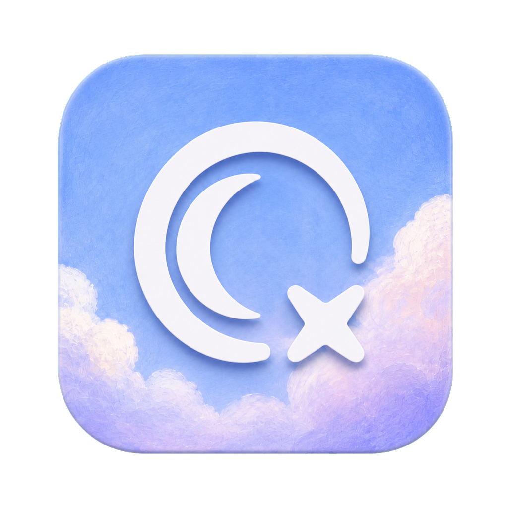
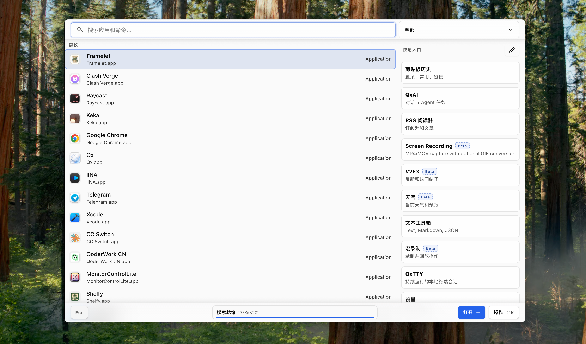
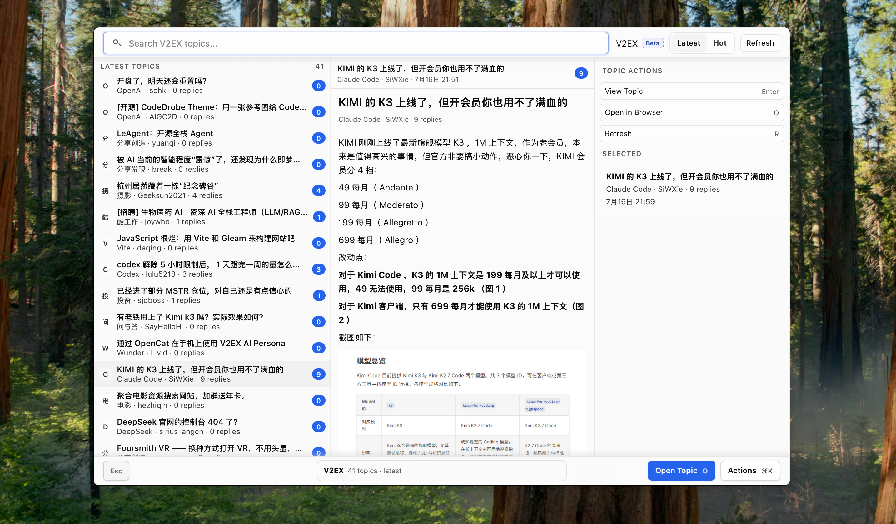
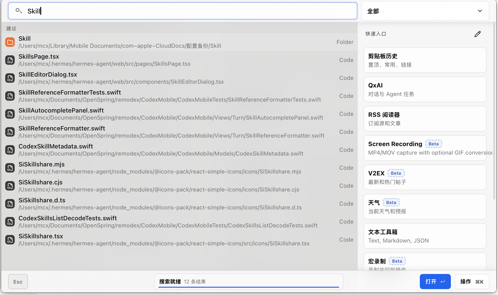

<!-- language: en -->

> **Version**: v0.6.11 — current release

<a id="readme-en"></a>

<div align="center">



# Qx

**Qx** is a background-resident productivity launcher inspired by
[Raycast](https://raycast.com). Press a global hotkey, search apps, files,
clipboard history, and plugins — run what you need, then hide again.

Built with **Tauri 2 · React · Rust**. Runs on **macOS** and **Windows**.

[Installing](#installing)
· [Building from source](#building-from-source)
· [Features](#features)
· [Documentation](#documentation)
· [Repository layout](#repository-layout)
· [Plugins](#plugins)
· [中文](#readme-zh)
· [License](#license)

Main Search:




RSS 阅读


V2EX插件




***


## Installing

### macOS (Homebrew)

```sh
brew tap mcxen/qx
brew install --cask qx
brew upgrade --cask qx   # later
```

### Releases

Prebuilt packages are published on
[GitHub Releases](https://github.com/mcxen/qx/releases):

| Platform                | Package                                                                                        |
| ----------------------- | ---------------------------------------------------------------------------------------------- |
| **macOS** Apple Silicon | `.app.zip` → unzip into `/Applications` · first open: right-click → **Open**                   |
| **Windows** x64         | NSIS installer · [WebView2](https://developer.microsoft.com/microsoft-edge/webview2/) required |

Qx stays in the menu bar / system tray after setup until you summon it.

**Default hotkey (macOS):** `⌥ Space` — press again to hide.

Navigate with `↑` `↓` `Enter` · actions with `⌘K` / `Ctrl+K` · leave with `Esc`.

***

## Building from source

**Requirements**

- **Node.js** ≥ 20

- **Rust** (stable toolchain via `rustup`)

- **macOS 14+**, or **Windows 10/11** with MSVC + WebView2

```sh
git clone https://github.com/mcxen/qx.git
cd qx
npm install
npm run tauri dev          # build + launch the desktop app
```

```sh
npx tsc --noEmit
npm run build
npm run check              # architecture, docs, i18n, shell, island gates
cd src-tauri && cargo fmt --check && cargo check

# macOS arm64 app bundle
npm run tauri build -- --target aarch64-apple-darwin --bundles app
```

Architecture rules, Esc protocol, and UI conventions:
[`AGENTS.md`](./AGENTS.md).

***

## Features

| Area          | What you get                                                   |
| ------------- | -------------------------------------------------------------- |
| **Launcher**  | Apps, files, commands, aliases · fuzzy search · calculator     |
| **Clipboard** | Text / image / file history · pin · paste at cursor            |
| **Capture**   | Screenshot & region record (MP4/MOV) · annotate · GIF          |
| **RSS**       | Feeds, folders, OPML, inline reading                           |
| **QxAI**      | Streaming chat · OpenRouter / DeepSeek / custom BYOK           |
| **Plugins**   | Sandboxed runtime · zip import · marketplace · Raycast convert |

Also built in: weather · V2EX · macros · OCR · text tools · themes & shortcuts.

***

## Documentation

| Doc                                                                                  | Audience                                     |
| ------------------------------------------------------------------------------------ | -------------------------------------------- |
| [`docs/README.md`](./docs/README.md)                                                 | Contributor index (architecture, IPC, shell) |
| [`public/doc/README.md`](./public/doc/README.md)                                     | Author / operator docs index                 |
| [`public/doc/plugin-development-guide.md`](./public/doc/plugin-development-guide.md) | **Plugin authors — start here**              |
| [`public/doc/plugin-cli-protocol.md`](./public/doc/plugin-cli-protocol.md)           | `context.cli` contract (local tools)         |
| [`docs/plugin-storage.md`](./docs/plugin-storage.md)                                 | Plugin package vs durable data               |
| [`public/doc/release-workflow.md`](./public/doc/release-workflow.md)                 | Tag & publish flow                           |
| [`UI_SPEC.md`](./UI_SPEC.md)                                                         | UI tokens, shell layout, scrollbars          |
| [`AGENTS.md`](./AGENTS.md)                                                           | Working rules for humans and coding agents   |

***

## Repository layout

| Path          | Contents                                                                |
| ------------- | ----------------------------------------------------------------------- |
| `src/`        | React shell and built-in modules (clipboard, RSS, capture, settings, …) |
| `src/plugin/` | Plugin registry, runtime iframe, RPC, host ports                        |
| `src-tauri/`  | Rust core: marketplace, clipboard, capture, CLI / file / HTTP ports     |
| `public/doc/` | User- and author-facing guides                                          |
| `docs/`       | Internal architecture for contributors                                  |
| `scripts/`    | Checks, Raycast converter, packaging helpers                            |
| `AGENTS.md`   | Agent / contributor working rules                                       |

***

## Plugins

Install from **Settings → Extensions** (browse the marketplace, or **Import** a
`.qx-plugin` / `.zip` package).

Author a plugin under `~/.qx/plugins/<id>/` (`manifest.json` + `index.js`), or
publish to [`mcxen/qx-plugins`](https://github.com/mcxen/qx-plugins).

```sh
# Convert a Raycast extension tree (optional)
node scripts/convert-raycast-extension.mjs /path/to/extension --out /tmp/qx-out --package
```

Prefer host **ports** over OS details: `context.cli`, `context.http`,
`context.storage`, with permissions declared in the manifest. See the
[plugin development guide](./public/doc/plugin-development-guide.md).

Marketplace examples: **Brew** (macOS CLI), **Unsplash**, **Qx Bing Wallpaper**,
Calendar, V2EX.

***

## License

Source-available — see [`LICENSE`](./LICENSE)
(**Qx Source-Available License v1.0**).

- **Personal / non-commercial:** view, study, modify, run

- **Commercial use, redistribution, or SaaS:** written permission required

***

## Credits

[Raycast](https://raycast.com) · [Tauri](https://tauri.app) ·
[Geist](https://vercel.com/geist) ·
[Everything](https://www.voidtools.com/) (Windows file index)

***

<!-- language: zh -->

<a id="readme-zh"></a>

<div align="center">


# Qx — 效率启动器

**Qx** 是后台常驻的效率启动器（灵感来自 [Raycast](https://raycast.com)）：
全局快捷键唤起 → 搜索 → 执行 → 再按同一快捷键收起。

技术栈：**Tauri 2 · React · Rust**，支持 **macOS** 与 **Windows**。

[安装](#安装)
· [从源码构建](#从源码构建)
· [功能](#功能)
· [文档](#文档)
· [仓库结构](#仓库结构)
· [插件](#插件)
· [English](#readme-en)
· [许可](#许可)



</div>

***

## 安装

### macOS（Homebrew）

```sh
brew tap mcxen/qx
brew install --cask qx
brew upgrade --cask qx   # 升级
```

### 发行包

预编译包发布于
[GitHub Releases](https://github.com/mcxen/qx/releases)：

| 平台                      | 包                                                                                 |
| ----------------------- | --------------------------------------------------------------------------------- |
| **macOS** Apple Silicon | `.app.zip` → 解压到 `/Applications` · 首次打开：右键 → **打开**                               |
| **Windows** x64         | NSIS 安装包 · 需 [WebView2](https://developer.microsoft.com/microsoft-edge/webview2/) |

安装后常驻菜单栏 / 托盘，按快捷键唤起。

**默认快捷键（macOS）：** `⌥ Space`（再次按下隐藏）。

导航：`↑` `↓` `Enter` · 操作：`⌘K` / `Ctrl+K` · 返回：`Esc`。

***

## 从源码构建

**环境要求**

- **Node.js** ≥ 20

- **Rust**（`rustup` 安装的 stable 工具链）

- **macOS 14+**，或 **Windows 10/11**（MSVC + WebView2）

```sh
git clone https://github.com/mcxen/qx.git
cd qx
npm install
npm run tauri dev          # 构建并启动桌面应用
```

```sh
npx tsc --noEmit
npm run build
npm run check              # 架构 / 文档 / i18n / Shell / Island 门禁
cd src-tauri && cargo fmt --check && cargo check

# macOS arm64 应用包
npm run tauri build -- --target aarch64-apple-darwin --bundles app
```

架构约定、Esc 协议与 UI 规范见 [`AGENTS.md`](./AGENTS.md)。

***

## 功能

| 模块        | 说明                                      |
| --------- | --------------------------------------- |
| **启动器**   | 应用、文件、命令、别名 · 模糊搜索 · 计算器                |
| **剪贴板**   | 文本 / 图片 / 文件历史 · 置顶 · 光标处粘贴             |
| **截图与录屏** | 区域 / 窗口 · 标注 · MP4/MOV · 可转 GIF         |
| **RSS**   | 订阅、文件夹、OPML、应用内阅读                       |
| **QxAI**  | 流式对话 · OpenRouter / DeepSeek / 自定义 BYOK |
| **插件**    | 沙盒运行时 · 压缩包 Import · 市场 · Raycast 转换    |

另含：天气 · V2EX · 宏 · OCR · 文本工具 · 主题与快捷键。

***

## 文档

| 文档                                                                                   | 读者                  |
| ------------------------------------------------------------------------------------ | ------------------- |
| [`docs/README.md`](./docs/README.md)                                                 | 贡献者索引（架构、IPC、Shell） |
| [`public/doc/README.md`](./public/doc/README.md)                                     | 作者 / 运维文档索引         |
| [`public/doc/plugin-development-guide.md`](./public/doc/plugin-development-guide.md) | **插件作者总手册**         |
| [`public/doc/plugin-cli-protocol.md`](./public/doc/plugin-cli-protocol.md)           | `context.cli` 协议    |
| [`docs/plugin-storage.md`](./docs/plugin-storage.md)                                 | 插件包与持久数据分离          |
| [`public/doc/release-workflow.md`](./public/doc/release-workflow.md)                 | 打 tag 发版流程          |
| [`UI_SPEC.md`](./UI_SPEC.md)                                                         | UI 规范与滚动条等          |
| [`AGENTS.md`](./AGENTS.md)                                                           | 人与编码 Agent 的工作规范    |

***

## 仓库结构

| 路径            | 内容                                  |
| ------------- | ----------------------------------- |
| `src/`        | React 壳与内置模块（剪贴板、RSS、截图、设置等）        |
| `src/plugin/` | 插件注册、iframe 运行时、RPC、宿主端口            |
| `src-tauri/`  | Rust 核心：市场、剪贴板、截图、CLI / 文件 / HTTP 等 |
| `public/doc/` | 面向用户 / 插件作者的文档                      |
| `docs/`       | 贡献者架构文档                             |
| `scripts/`    | 检查脚本、Raycast 转换器等                   |
| `AGENTS.md`   | Agent / 贡献者工作规范                     |

***

## 插件

在 **设置 → 扩展** 中安装：市场 Browse，或 **Import** 本地 `.qx-plugin` / `.zip`。

开发目录：`~/.qx/plugins/<id>/`（`manifest.json` + `index.js`）；也可发布到
[`mcxen/qx-plugins`](https://github.com/mcxen/qx-plugins)。

```sh
# 可选：转换 Raycast 扩展
node scripts/convert-raycast-extension.mjs /path/to/extension --out /tmp/qx-out --package
```

业务只依赖宿主**端口**（`context.cli` / `http` / `storage` 等）与 manifest
权限，不要直接绑 OS 细节。详见
[插件开发手册](./public/doc/plugin-development-guide.md)。

市场示例：**Brew**（macOS）、**Unsplash**、Bing 壁纸、日历、V2EX 等。

***

## 许可

源码可用协议 — 见 [`LICENSE`](./LICENSE)
（**Qx Source-Available License v1.0**）。

- **个人 / 非商业：** 查看、学习、修改、运行

- **商业使用、再分发或 SaaS：** 需书面许可

***

## 致谢

[Raycast](https://raycast.com) · [Tauri](https://tauri.app) ·
[Geist](https://vercel.com/geist) ·
[Everything](https://www.voidtools.com/)（Windows 文件索引）
