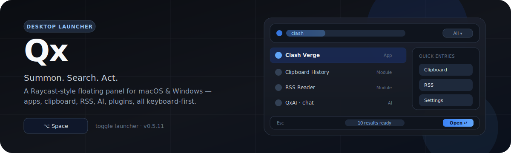

<p align="right">
  <strong>English</strong> · <a href="#qx--macos--windows-效率启动器">简体中文</a>
</p>

# Qx — macOS & Windows Productivity Launcher


<p align="center">
  
</p>

<p align="center">
  <a href="https://github.com/mcxen/qx/releases"></a>
  <a href="./LICENSE"></a>
  
  
</p>

**Qx** is a background-resident productivity launcher. Press a global hotkey, search, act, dismiss — without leaving the keyboard. Inspired by Raycast, open-source, and built as a native floating panel on **macOS** and **Windows**.

| You need… | Qx does… |
| --- | --- |
| Launch apps & files fast | Fuzzy search + native file backends (Spotlight / Everything) |
| Reuse what you just copied | Persistent clipboard history (text, image, files) |
| Stay in flow | One shell: RSS, weather, QxAI, V2EX, macros, plugins |

> **Status**: v0.5.23 — active development · [Releases](https://github.com/mcxen/qx/releases) · [Docs](./docs/README.md)

---

<p align="center">
  
</p>

<p align="center">
  
</p>

<p align="center">
  &nbsp;
  
</p>

<p align="center">
  
</p>

<p align="center">
  
</p>

---

<p align="center">
  
</p>

### Core

| Module | What it gives you |
| --- | --- |
| **Launcher** | Apps, files, commands, plugin actions, aliases/tags, inline calculator |
| **Clipboard** | Text / image / file history, pin, filter, native paste-out, media tools |
| **RSS** | Feeds, folders, OPML, inline reading, star, refresh |
| **QxAI** | Streaming chat · OpenRouter / DeepSeek / custom BYOK · memory |
| **Plugins** | Sandboxed iframe runtime, marketplace, Raycast extension conversion |

### Also built-in

**Screen GIF** · **Weather** · **V2EX** · **Macros** · **OCR** · **GitHub calendar** · **Dev text tools** · **Settings** (theme, shortcuts, permissions, agent tools)

### Keyboard-first shell

| Key | Action |
| --- | --- |
| `⌥ Space` (macOS default) | Toggle main window |
| `↑` / `↓` · `Enter` | Navigate · open |
| `Esc` | Cascade: detail → clear query → leave module / hide |
| `⌘K` / `Ctrl+K` | Actions menu |
| Module hotkeys | Optional; **same key opens and closes** that module |

Shell layout is always **Top bar · Main · Bottom bar** with a centered Dynamic Island for status, progress, and idle system metrics.

---

<p align="center">
  
</p>

### macOS — Homebrew (recommended)

```bash
brew tap mcxen/qx
brew install --cask qx
```

```bash
brew upgrade --cask qx   # update
```

> **China network tip**: if GitHub is slow, clone the tap over SSH:  
> `git clone git@github.com:mcxen/homebrew-qx.git /opt/homebrew/Library/Taps/mcxen/homebrew-qx`

### Manual

| Platform | Download | Notes |
| --- | --- | --- |
| **macOS Apple Silicon** | [`*.app.zip` from Releases](https://github.com/mcxen/qx/releases) | Unzip → `/Applications` · first open: right-click → Open |
| **Windows x64** | NSIS `.exe` from Releases | WebView2 required · Everything engine bundled for file search |

After onboarding, Qx stays in the background (menu bar / tray) until the global hotkey summons it.

---

<p align="center">
  
</p>

```text
┌─────────────────────────────────────────────┐
│  React 19 UI  ·  QxShell  ·  module panels  │
│  Zustand · i18n (EN / 简体中文) · plugins    │
├─────────────────────────────────────────────┤
│  Tauri v2  ·  typed invoke + events         │
├─────────────────────────────────────────────┤
│  Rust core: apps · clipboard · rss · AI     │
│  floating_panel · shortcuts · storage       │
│  macOS AppKit/Mach  │  Windows Win32        │
└─────────────────────────────────────────────┘
```

| Layer | Stack |
| --- | --- |
| Shell | Tauri v2, tray, frosted glass, global shortcuts |
| Frontend | React 19, TypeScript, Vite, Tailwind v4, Zustand |
| Native | SQLite, scrap/gifski, feed-rs, reqwest, platform adapters |

Deep dives: [`docs/README.md`](./docs/README.md) · [`docs/shell-and-shortcuts.md`](./docs/shell-and-shortcuts.md) · [`UI_SPEC.md`](./UI_SPEC.md)

---

<p align="center">
  
</p>

### Prerequisites

- Rust (edition 2021) · Node.js ≥ 20  
- macOS 14+ **or** Windows 10/11 x64 + MSVC + WebView2  

```bash
git clone https://github.com/mcxen/qx.git
cd qx
npm install
npm run tauri dev
```

```bash
# ship macOS arm64 app bundle
npm run tauri build -- --target aarch64-apple-darwin --bundles app

# validate
cd src-tauri && cargo check
npx tsc --noEmit
npm run docs:check
```

### Plugins (short)

Sandboxed iframes + `postMessage` RPC. Declare permissions in `manifest.json`. With `ai` permission, plugins use `context.ai` (chat, stream, optional bash/grep/memory/tasks — gated by Settings → AI Agent).

- Install from Settings → Extensions (marketplace, `.zip` / `.qx-plugin`, GitHub URL)
- Convert Raycast extensions: paste a Raycast tree URL or use `scripts/convert-raycast-extension.mjs`
- Whitepaper: [`public/doc/plugin-system.md`](./public/doc/plugin-system.md)

### Contributing

1. Read [`AGENTS.md`](./AGENTS.md) and [`UI_SPEC.md`](./UI_SPEC.md)  
2. Branch → change → `cargo check` + `npx tsc --noEmit`  
3. Open a PR  

Esc cascade, CSS tokens (`var(--qx-*)`), and no raw native range/checkbox/select controls are enforced project rules.

---

## License

Source-available — full terms in [LICENSE](./LICENSE).

- ✅ Personal / non-commercial view, study, modify  
- ❌ Commercial use, redistribution, or SaaS needs **written permission**  

---

## Acknowledgments

[Raycast](https://raycast.com) (product pattern) · [Tauri](https://tauri.app) · [Vercel Geist](https://vercel.com/geist) · [Everything](https://www.voidtools.com/) (Windows file index, MIT)

<p align="center">
  <a href="https://github.com/oil-oil/beautify-github-readme"></a>
</p>

---

# Qx — macOS & Windows 效率启动器

<p align="right">
  <a href="#qx--macos--windows-productivity-launcher"><strong>English</strong></a> · <strong>简体中文</strong>
</p>

**Qx** 是后台常驻的效率启动器：全局快捷键唤起，搜索 → 执行 → 再按同一快捷键收起。灵感来自 Raycast，基于 **Tauri v2 + React 19 + Rust**，支持 macOS 与 Windows。

> **版本**: v0.5.23 · [发布页](https://github.com/mcxen/qx/releases) · [开发者文档](./docs/README.md)

### 你能做什么

| 模块 | 说明 |
| --- | --- |
| **启动器** | 应用 / 文件 / 命令 / 插件 / 别名；Windows 内置 Everything 索引 |
| **剪贴板** | 文本、图片、真实文件；置顶、筛选、原生粘出 |
| **RSS** | 订阅、文件夹、OPML、内联阅读 |
| **QxAI** | 流式对话、OpenRouter / DeepSeek / 自定义 BYOK、记忆 |
| **插件** | 沙盒 iframe、市场、Raycast 扩展转换、`context.ai` |

另有：MP4/MOV 录屏（可转 GIF）· 天气 · V2EX · 宏 · OCR · GitHub 贡献图 · 开发者文本工具。

默认快捷键（可改）：**Option+Space** 切换主窗口；模块快捷键**再按一次关闭**。

### 安装

```bash
brew tap mcxen/qx
brew install --cask qx
```

或从 [Releases](https://github.com/mcxen/qx/releases) 下载 macOS `.app.zip` / Windows NSIS 安装包。

### 开发

```bash
git clone https://github.com/mcxen/qx.git && cd qx
npm install
npm run tauri dev
```

架构与快捷键约定见 [`docs/shell-and-shortcuts.md`](./docs/shell-and-shortcuts.md)。

### 许可证

源码可用：个人/非商业可阅读与修改；商业用途需书面授权。详见 [LICENSE](./LICENSE)。
