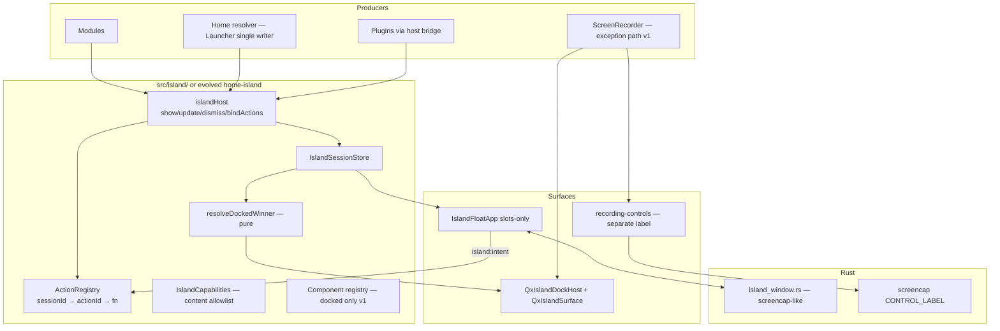
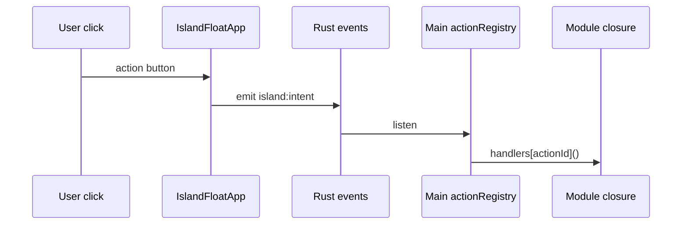

# QxIsland 统一抽象层设计

| 字段 | 值 |
|---|---|
| **Title** | QxIsland 统一抽象层：信息通道 / 尺寸界面 / 能力与样式，重构全部灵动岛 |
| **Author** | — |
| **Date** | 2026-07-15 |
| **Status** | Implemented (docked + draggable desktop float; Qx-owned policy) · rev 3.4 |
| **Repo path** | `docs/qx-island-architecture.md` |
| **Related** | `UI_SPEC.md` Bottom Island / Home Island；`src/home-island/`；`src/components/QxBottomIsland.tsx`；`src-tauri/src/floating_panel.rs`；`src-tauri/src/screencap/mod.rs`；`src/modules/screencap/ScreenRecorder.tsx` |

---

## Overview

Qx 当前存在多套并行的「灵动岛」实现：Shell 文本岛（`QxBottomIsland`）、Home 可插拔空闲 HUD（`src/home-island/` 下各 mode 自带 chrome）、App 级插件状态岛（`pluginIsland` React state）、以及 ScreenRecorder 的 `customIsland` + 独立 `recording-controls` 浮窗。它们在**尺寸、居中、玻璃 chrome、优先级、数据采样、动作回调**上各自为政。

尺寸方面：实现层 shell 为 32px / `min(340px, …)`，home 模式为 34px / 360–400px；**UI_SPEC 对 shell 仍写 32px 默认高**，对 custom Home 写约 34–36 / ~400。统一到固定 **34×≤400** 是**有意的 UI_SPEC 修订**，不是“已经与规范对齐”。同时，岛生命周期与主窗口、模块 props 树强绑定，无法模块化请求、无法（通用地）脱离主窗口悬浮交互。

本设计引入统一 **QxIsland** 接口层，将「会话状态（session）」「呈现宿主（surface）」「数据通道（channels）」「受限能力（capabilities）」「动作注册（action registry）」分离。Docked / floating 表面订阅可序列化 session；chrome 由单一 `QxIslandSurface` 拥有；模块通过 `islandHost` 发布状态与绑定动作。浮窗**以 `screencap` `recording-controls` 为蓝本**（非 main NSPanel），实现可脱离主窗口、可交互、异步显示解耦的通用灵动岛（录制控件 v1 仍为分类例外，见 §9）。

---

## Background & Motivation

### 现状拆解

```text
模块 / Launcher / App.pluginIsland / ScreenRecorder
        │  island?: BottomIslandContent
        │  customIsland?: ReactNode   ← Home modes + RecordingTransport
        ▼
   QxShell bottombar
        │  customIsland ?? <QxBottomIsland />
        ▼
   各自 CSS chrome（多套 absolute + 不同 width/height）

另路：screencap recording-controls webview（label 独立，非 island 统一层）
```

| 路径 | 入口 | 问题 |
|---|---|---|
| Shell Bottom Island | `QxBottomIsland` + `BottomIslandContent` | 高 32px、宽 `min(340px, …)`；无 priority / ttl / placement；`onAction` 闭包不可跨 webview |
| Home Island | `resolveHomeIsland` → `shellContent` \| `customNode` | `kind: "custom"` 自带 absolute chrome |
| Plugin island | `App.tsx` `pluginIsland` + timer | 与 Launcher 硬编码竞争；非全局 API |
| ScreenRecorder | `customIsland={<RecordingTransport/>}` + `CONTROL_LABEL` 浮窗 | 交互 HUD；与统一层/浮窗池未分类 |
| Generic floating island | **不存在** | 仅 `floating_panel` 管 `main`；录制是次级窗先例 |

### 尺寸不一致根因（必须消灭）

自定义模式**拥有** chrome CSS，而不是渲染在共享 surface 内：

| 选择器 | 高度 | 宽度 | 文件 |
|---|---|---|---|
| `.qx-bottom-island` | 32px（max 36） | `min(340px, calc(100% - 260px))` | `src/styles/shell.css` |
| `.qx-home-system-island` | 34px | `min(100%, 380px)` | 同上 |
| `.qx-home-sci-island` | 34px | `min(100%, 400px)` | 同上 |
| `.qx-home-date-island` | 34px | `min(100%, 360px)` | 同上 |
| `recording-controls` 窗 | 逻辑 36px | 逻辑 340px | `screencap/mod.rs` |

UI_SPEC（当前）：

- Bottom Island 默认高度 **32px**，最大 36px（Bottom Bar 节）。
- 自定义 Home Island：约 **34–36px**，宽 `min(100%, ~400px)`，绝对居中；窄屏与 Bottom Island 同规则。

实现与 UI_SPEC 内部也分裂（shell 32 vs home 34）。统一层将修订为单一 chrome 契约（§3.1、Key Decision 2）。

### 其它痛点

1. **信息通道分裂**：metrics 有 `home-island/data/bus.ts`；任务/插件是组件 state；无全局 priority comparator。
2. **模块不可调用**：只能 props；tab 切换后 sticky 任务无处挂。
3. **动作不可序列化**：`onAction` 闭包无法进浮窗。
4. **无法通用 detach**：无 `island` 标签轻量窗；录制浮窗是特例。
5. **异步解耦不足**：无 generation / TTL / rank 与 content 时间戳分离。

### 可复用资产

- Metrics bus（interest / idle / hidden / in-flight）提升为 island-wide。
- **`screencap/mod.rs` `recording-controls`**：次级 webview **主蓝本**（`focused(false)`、`always_on_top`、透明、无 decorations、逻辑尺寸、物理定位）。
- `floating_panel.rs`：仅 **main** 的 macOS NSPanel；Windows `show_floating` 会 `set_focus`——**不得**当作 island 浮窗范式。
- QxShell bottombar 居中：`position: relative` + island `left: 50%; transform: translateX(-50%)`。
- Tauri 事件命名先例：纯字符串如 `"screencap:state"`、`"settings-updated"`、`"clipboard-updated"`（**不用** `qx://` URL 风格）。

---

## Goals & Non-Goals

### Goals

1. **单一呈现契约**：`QxIslandSurface` 拥有外轮廓尺寸、radius、glass/border（按 variant 表）、docked 居中；内容仅填 slots / 注册组件内层。
2. **统一信息通道**：metrics / status / intent；docked 优先级 task > error > toast > location > home，含完整 comparator（§4.3）。
3. **模块可调用 API**：`islandHost.show / update / dismiss / bindActions`（及插件 bridge）。
4. **可脱离主窗口**（通用岛）：label `island` 轻量 webview；默认不抢焦点；可点击；主窗 hide 后 standing plugin/module 与 sticky task 可展示（设置控制）。默认几何为主屏工作区右上。
5. **异步显示解耦**：可序列化 session + **host 分配 generation**；surface 独立订阅。
6. **分类迁移全部 call site**：每个 `island=` / `customIsland=` 归入 slots | registered component | **v1 永久/阶段性例外**（§9 表）；不得口头“全部”而不列 screencap。
7. **跨平台**：macOS + Windows 行为对等目标以 **screencap 旗标** 为准，不要求 island 成为 NSPanel。

### Non-Goals

- v1 **不**允许插件向浮窗注入任意 React / remote code（仅 slots；priority/placement 封顶见 §5 / Security）。
- 不做多枚 docked 岛；浮窗池 1 个 active `island` 窗，多 session 在同一 surface 轮播。
- v1 **不**把 island 做成第二应用壳 / 完整 Esc 级联。
- **不**用进程级 Esc monitor。
- **不**重做 Appearance IA（仅加 float 开关字段）。
- v1 浮窗 **不**渲染 Home `componentId` 富组件（slots-only）；Home 指标岛仅 docked。
- v1 **不**把 `recording-controls` 强行合并进 `island` label（保留独立窗；见 §9）。
- v1 types **不**暴露未实现的 `queue` / `dual`。
- **不**要求 Home 内部视觉语言同质化，但 chrome **尺寸与定位**必须统一。

---

## Proposed Design

### 1. 总体架构



**原则**：Producer 推 session + 注册 actions；Surface 订 session；Chrome 不在 content 根；Intent 回 primary host 的 ActionRegistry。

### 2. 包结构（演化而非并行）

优先 **在现路径演进**，避免 PR3 大搬家：

```text
src/island/                    # 新公共层（可先建，home 暂留）
  index.ts
  types.ts
  surface/
    QxIslandSurface.tsx
    ShellContent.tsx           # 原 QxBottomIsland 内布局
    layout.md / comments       # slot 组合布局契约
  session/
    store.ts
    priority.ts                # resolveDockedWinner pure
    hostApi.ts                 # islandHost
    actionRegistry.ts
    sync.ts                    # events: island:sessions / island:intent
  data/                        # 或 re-export home-island/data 至 PR3b
  float/
    IslandFloatApp.tsx
  bridge/
    pluginIslandBridge.ts
  compat/
    mapBottomIslandContent.ts
    useShellIslandShim.ts

src/home-island/               # PR3a 先 content-only；PR3b 可选迁入 island/home
src-tauri/src/island_window.rs
```

`src/home-island/*` 对外 export 保持稳定至少一个版本；物理迁移非 v1 阻塞项。

### 3. Presentation contract

#### 3.1 尺寸 token（UI_SPEC 修订）

**Key Decision 2**：有意修订 UI_SPEC，使 shell 与 home 共用 chrome：

```css
:root {
  --qx-island-height: 34px;
  --qx-island-height-min: 32px; /* 窄屏/无障碍降级下限，content 仍不得撑破 max */
  --qx-island-height-max: 36px;
  --qx-island-pad-x: 10px;
  --qx-island-radius: 8px;
  --qx-island-gap: 8px;
  --qx-island-font-primary: 12px;
  --qx-island-font-secondary: 11px;
  --qx-island-font-tag: 9px;

  /* Esc + Actions 预算：与现 calc(100% - 260px) 一致；PR1 需对照 Windows 长标签实测 */
  --qx-island-docked-width: min(400px, calc(100% - 260px));
  --qx-island-docked-min-width: 220px;

  --qx-island-float-width: 400px;
  --qx-island-float-height: 34px;
}
```

PR1 落地 token + Surface 时 **同时**改 shell 视觉（34/400 上限）；PR5 改写 UI_SPEC 对应段落。验收必须包含底栏高度不增长（`--qx-bottom-bar-h` 仍包住 34px island）。

窄屏（继承 UI_SPEC，统一到 `.qx-island-surface`）：

| 宽度 | 行为 |
|---|---|
| 681–860px | 隐藏 secondary；可缩宽 `min(340px, calc(100% - 220px))` |
| ≤680px | docked island `display: none`；**task/error** 必须在模块主 UI 有等价态；不得因为窄屏自动 promote 浮窗 |

#### 3.2 `QxIslandSurface` 与 variant chrome 所有权

```tsx
export type IslandPlacement = "docked" | "floating";
export type IslandTone = "neutral" | "success" | "warning" | "danger";
export type IslandChromeVariant = "shell" | "system" | "sci" | "date";

export interface QxIslandSurfaceProps {
  placement: IslandPlacement;
  tone?: IslandTone;
  variant?: IslandChromeVariant;
  empty?: boolean;
  children: React.ReactNode;
  className?: string;
  "aria-label"?: string;
}
```

**Chrome 所有权表**（防止尺寸再分裂）：

| CSS 职责 | 落点 | 示例 |
|---|---|---|
| `position` / `left` / `transform`（docked 居中） | **仅** `.qx-island-surface[data-placement=docked]` | 禁止 mode 根再 absolute 居中 |
| `width` / `min-width` / `height` / `min-height` / `max-height` | **仅** surface | token 驱动 |
| `border` / `border-radius` / `box-shadow` / 玻璃 `background`+`backdrop-filter` | surface；variant 可改 token 级 bg/border **mix** | `data-variant=sci` 点阵底可做 surface 背景层 |
| 内边距 `padding` | surface | |
| `overflow` | surface `hidden`（progress 内嵌，不靠 overflow:visible 撑高） | |
| mono / letter-spacing | surface variant 或 content 根 class **但不设尺寸** | sci/date |
| sparkline / matrix / marquee / beacon 点 | **content only** | |
| 内层 flex / gap | content | 不得改变 surface 外高 |

PR 顺序：

- **PR1**：只实现 `variant=shell` 的 surface chrome；迁移 `QxBottomIsland`。
- **PR3a**：把 system/sci/date 的 border/bg/shadow **迁入** `data-variant` surface 规则，并 **同一 PR** 从 mode 根删除 absolute + width/height。  
  验收：`rg 'position:\\s*absolute' src/home-island/modes` 与 `left:\\s*50%` 应为 0（content 内部定位除外需白名单注释）。

#### 3.3 Content slots

```ts
export interface IslandSlotContent {
  identity?: {
    tag?: string;
    beacon?: "live" | "steady" | "off";
    iconName?: string;
  };
  primary: string;
  secondary?: string;
  meter?: {
    kind: "progress" | "activity";
    progress?: number; // 0–100, never fake
    activity?: "wave" | "dots" | "spinner" | "pulse";
  };
  action?: {
    id: string; // must exist in ActionRegistry for this session when clickable
    label: string;
    icon?: "pause" | "play" | "stop" | "open";
    variant?: "default" | "danger";
  };
  actions?: Array<{
    id: string;
    label: string;
    icon?: "pause" | "play" | "stop" | "open";
    variant?: "default" | "danger";
  }>; // host modules: max 2; plugins remain max 1
  effect?: { kind: "orbit"; nonce: number };
  countdown?: {
    endsAt?: number;      // running: Unix ms, host updates text locally
    remainingMs?: number; // paused/fallback
    durationMs?: number;  // host-derived progress
    paused?: boolean;
  };
  tone?: IslandTone;
  /** Docked only in v1 float; float ignores unknown componentId and falls back to slots if present */
  componentId?: string;
  componentProps?: Record<string, unknown>; // JSON-serializable
}
```

| 旧 `BottomIslandContent` | 新 |
|---|---|
| `label` | `primary` |
| `detail` | `secondary` |
| `progress` / `activity` | `meter` |
| `actionLabel` / `onAction` | `action` + **`bindActions`（§3.5）** |
| `actions[]` | `actions[]` + **`bindActions`（§3.5）** |
| `effect` | host-rendered one-shot `effect` |
| `tone` | `tone` |

#### 3.4 ShellContent 固定高度内布局（Issue 8）

Chrome **固定 34px**。`ShellContent` 使用 **单层网格**，progress **不得**作为第二 flex 行撑高：

```text
┌────────────────────────────────────────────────────────────┐
│ [identity] primary … secondary [activity?][countdown?][actions?] │  ← 一行，align center
│ ▓▓▓▓▓▓▓░░░░ progress 2px overlay along bottom edge         │  ← absolute bottom inset
└────────────────────────────────────────────────────────────┘
height: 34px; overflow: hidden;
trailing pack (right):  [activity][countdown][actions]  — actions always rightmost when present
```

**Trailing 锁定规则（PR1 唯一解释）**：

- 右侧为 **inline pack**：`activity`（若有）在左，`countdown` 使用等宽 tabular 数字居中，`action`（若有）**永远最右**。
- `countdown.endsAt` 是绝对 wall-clock deadline；docked 与 floating 的 `ShellContent` 各自在本地刷新，不要求 session store 每秒 update。暂停时使用固定 `remainingMs`。
- `countdown.paused === true` 时，宿主冻结倒计时/派生进度并强制不渲染 activity；这是
  renderer 不变量，不依赖 producer 是否正确移除旧 `pulse`。
- `action` / `actions` 只使用宿主受限图标集与统一 22px capsule（default/danger），包含 hover/active/focus-visible；宿主模块最多发布两个，插件仍限制为一个；producer 不能提供 DOM/CSS。
- `effect: { kind: "orbit", nonce }` 是宿主渲染的一次性完成反馈；`nonce` 变化才重播，且 `prefers-reduced-motion` 下禁用。
- 两者可同时存在（非互斥）；不换行；空间不足时 primary/secondary ellipsis，trailing 优先保留 action 再保留 activity。
- `progress` 与 `activity`：progress 始终底边 overlay；activity 在 trailing pack（对齐现 `QxBottomIsland`：progress 与 activity 不同时抢同一 meter 语义——若同时传入，**优先渲染 progress overlay，仍可保留 activity 动画**仅当 `meter.kind === "activity"`；`kind === "progress"` 时不渲染 activity 条）。

CSS 要点：

```css
.qx-island-surface {
  height: var(--qx-island-height);
  max-height: var(--qx-island-height-max);
  overflow: hidden;
  display: grid;
  align-items: center;
}
.qx-island-shell-row {
  display: grid;
  grid-template-columns: minmax(0, 1fr) auto;
  gap: var(--qx-island-gap);
  min-height: 0;
  align-items: center;
  padding: 0 var(--qx-island-pad-x);
}
.qx-island-shell-trailing {
  display: inline-flex;
  align-items: center;
  gap: 6px;
  flex: 0 0 auto;
}
.qx-island-meter-progress {
  position: absolute;
  left: 8px;
  right: 8px;
  bottom: 3px;
  height: 2px;
}
.qx-island-meter-activity {
  width: 64px;
  height: 16px;
}
```

组合矩阵：

| 组合 | 行为 |
|---|---|
| primary only | 单行截断 |
| + secondary | 同行 ellipsis |
| + progress | 底边 2px overlay；文案垂直仍居中 |
| + activity | trailing pack 左侧；无 action 时 activity 即为最右 |
| + countdown | `MM:SS` / `H:MM:SS`；等宽数字；可由 duration 派生 progress |
| + action | trailing pack **最右** capsule button，不换行 |
| + activity + countdown + action | `[activity][countdown][action]`，action 最右 |
| empty | `visibility: hidden` 保布局（docked） |

`wave`、`dots`、`spinner`、`pulse` 是唯一公开的不确定进度动画。动画由宿主绘制，
producer 不传 SVG/DOM/CSS。
session winner 改变时 `ShellContent` 播放一次短入场；同 session 的 progress/文案
更新不重播。`prefers-reduced-motion: reduce` 关闭全部活动与入场动画。

#### 3.5 Intent / Action 注册与分发（Issue 1）

可序列化 session **永不**含函数。Primary host（主窗口 React）维护：

```ts
// src/island/session/actionRegistry.ts
type ActionHandler = () => void | Promise<void>;

interface ActionRegistry {
  /** Replace handlers for session id; returns unbind */
  bind(sessionId: string, handlers: Record<string, ActionHandler>): () => void;
  unbind(sessionId: string): void;
  dispatch(sessionId: string, actionId: string): boolean;
  run(sessionId: string, actionId: string): Promise<boolean>;
}
```

`IslandActionButton` 是 Surface 内 business action 的唯一 renderer：固定 22px capsule、
受限图标、default/danger、focus-visible，并在 `run()` 未完成时进入 busy/disabled，防止
重复提交。Float compact/expand/open 控件属于 window chrome，不计入 producer action。

`islandHost` API：

```ts
islandHost.show({
  id: "clipboard.compress",
  priority: "task",
  // ...serializable fields
  content: {
    primary: "…",
    action: { id: "cancel", label: "Cancel" },
  },
  // out-of-band: NOT in snapshot, NOT synced to float
  actions: {
    cancel: () => void cancelCompress(),
  },
});

// 等价拆分：
islandHost.bindActions("clipboard.compress", { cancel: () => … });
```

规则：

1. `show` / `update` 若带 `actions`，merge 进 registry；`dismiss(id)` / 显式 `unbind` 清除。
2. **Shim**：`BottomIslandContent.onAction` → 自动 `action.id = "default"`（若仅有 actionLabel）并 `bindActions(id, { default: onAction })`；shim unmount 时 unbind。
3. **Docked 点击**：`ShellContent` → `actionRegistry.dispatch(sessionId, actionId)`。
4. **Float 点击**：emit Tauri `"island:intent"` `{ type: "action", sessionId, actionId }` → 主窗 listener → `dispatch`。
5. **主 webview 已销毁/未就绪**：  
   - v1 **不**在 Rust 执行任意模块 cancel；  
   - 仅允许 **内置白名单 intent**（可选后续）：如 `dismiss` 会话、`open_main_and_retry`（**不**自动 `floating_show` 除非用户设置允许且来自主机路径）。  
   - 默认：intent 入 Rust 短队列，主窗下次可见时 flush；UI 可短暂 disable action。
6. 未知 `actionId`：`dispatch` 返回 false；dev log；不 throw。



#### 3.6 QxShell 集成与 docked 合成策略

```tsx
<div className="qx-shell-bottombar">
  <div className="qx-shell-left">…</div>
  <QxIslandDockSlot />
  <div className="qx-shell-actions">…</div>
</div>
```

**`QxIslandDockSlot` 渲染策略（v1 锁定 — Option 1，贴近今日 UX）**：

| 条件 | docked 中心渲染 | store docked winner |
|---|---|---|
| 当前 Shell 传入 **classified exception** `customIsland`（§9，如 ScreenRecorder `RecordingTransport`） | **仅**渲染 exception 节点（建议外包 `QxIslandSurface` 尺寸壳，若节点已自带 chrome 则不再套双重 border） | **被抑制**：不在底栏绘制 store winner |
| 无 exception；有 store winner | `<QxIslandDockHost />`（Surface + slots/component） | 正常显示 |
| 无 exception；无 session | empty Surface / hidden 占位 | — |
| 过渡期 Home `customNode`（PR3 前） | 视同 soft custom：若仍走 `customIsland` prop，**同样抑制** DockHost（与今日 `customIsland ?? island` 一致） | home 应尽快改为 session，避免双路径 |

**Store 在 exception 期间并不 dismiss**：

- sticky / 全局 task（如 `clipboard.compress`）**保留在 store**，仅 docked 被遮住。
- exception 挂载只抑制 docked，不自动打开桌面浮窗；任务必须在模块主 UI 保留等价态。
- exception 卸载后：取消抑制，docked 恢复 store winner。用户此前手动浮出的窗口按自身
  生命周期继续存在，直到用户关闭、关闭总开关或 session 消失。

PR2 验收 / 测试注记：

- unit：`resolveDockedRenderMode({ exception: true, winnerId }) === "exception"`；
- integration：recording 路由挂载时 store 仍含 sticky task；卸载后 DockHost 显示该 task。

兼容 shim：`useShellIslandShim({ island, customIsland, routeKey, exception?: boolean })`：

- `routeKey` 来自必填 `QxShell.islandKey`，必须是稳定、非本地化 identity，禁止由 title 推导；
- `island` → upsert `module.${routeKey}.shell` + bind onAction；序列化内容未变时不重复通知；unmount 仅 dismiss 该 shim id；
- QxShell 不直接渲染 `island` props；普通 docked 内容只有 `DockSlot → store winner → Surface` 一条渲染路径，避免 props 旁路掩盖 priority、placement 与 float controls；
- `exception: true` customIsland → 不写 store 为 floatable session；走上表抑制策略；
- Home 迁完后删除 soft custom 路径。

### 4. Information channel contract

#### 4.1 三类通道

1. **Metrics**：`data/bus` — stats/power/net；interest、idle、hidden、in-flight。  
2. **Status**：`IslandSession` 字典 + pure `resolveDockedWinner`。  
3. **Intent**：`island:intent` + ActionRegistry。

#### 4.2 Session 模型（v1 收窄类型）

```ts
export type IslandPriority = "task" | "error" | "toast" | "location" | "home";

/** v1 only — no dual */
export type IslandPlacementMode = "docked" | "floating" | "docked-or-float";

/** v1 only — queue 不存在 */
export type IslandReplacePolicy = "replace-same-id" | "reject-if-lower";

export interface IslandSession {
  id: string;
  /** Host-assigned monotonic per id; producers do not invent */
  generation: number;
  priority: IslandPriority;
  /**
   * Bumped only on show / priority / placement / sticky changes — NOT on
   * progress/label-only updates. Winner comparator uses this, not updatedAt.
   */
  rankEpoch: number;
  source: "module" | "home" | "plugin" | "shell" | "system";
  createdAt: number;
  /** Content/TTL bookkeeping; may change every progress tick */
  contentUpdatedAt: number;
  ttlMs?: number;
  replacePolicy: IslandReplacePolicy;
  placement: IslandPlacementMode;
  content: IslandSlotContent;
  openTarget?:
    | { kind: "launcher" }
    | { kind: "module"; id: string }
    | { kind: "plugin"; id: string };
  sticky?: boolean;
  /**
   * When true, high-frequency content updates must not change rankEpoch
   * (default true for meter.progress updates).
   */
  progressSilent?: boolean;
}
```

**Generation API（Issue 12）**：

```ts
// Producers never pass generation on show (ignored if passed).
const { generation } = islandHost.show({ id, priority, content, … });

// Updates are CAS-friendly:
islandHost.update(id, {
  expectedGeneration: generation, // optional; if mismatch → drop + return false
  content: { meter: { kind: "progress", progress: 40 } },
});
// Host always increments generation on successful show/update;
// returns new generation. Stale expectedGeneration → no-op.
```

跨 webview：snapshot 只含 serializable `IslandSession`；**以 main store 为 primary**。Float 只读 mirror。Float dismiss intent 与 main update 乱序：main 应用 intent 时再 CAS；过期 generation 的 content push 丢弃。

#### 4.3 Docked 完整 comparator（Issue 3）

```ts
const PRIORITY_RANK: Record<IslandPriority, number> = {
  task: 0,
  error: 1,
  toast: 2,
  location: 3,
  home: 4,
};

/**
 * Pure. Unit-tested in PR2.
 * Higher priority band wins (lower PRIORITY_RANK number).
 * Within band:
 *   1. sticky task/error preferred over non-sticky
 *   2. higher rankEpoch (not contentUpdatedAt)
 *   3. newer createdAt
 *   4. id lexicographic tie-break
 * Location policy after strict bands:
 *   1. current non-sticky module location
 *   2. fair rotation among background sticky locations
 */
function resolveDockedWinner(sessions: IslandSession[]): string | null;
```

**关键规则**：

| 规则 | 说明 |
|---|---|
| Progress 不抢槽 | `update` 仅改 content/meter 时 **只** bump `contentUpdatedAt` + `generation`，**不** bump `rankEpoch` |
| 前台位置优先 | 非粘性 `location` 表示当前模块上下文，固定高于后台粘性 `location`；RSS 阅读进度因此不会与番茄时钟轮播 |
| 后台公平轮播 | 只有粘性 `location` 进入 rotation；前台模块卸载后常驻 session 原地恢复，不需要重新 show |
| 显式抢槽 | 仅 `show` 新 id、或 `update` 改 `priority` / `sticky` / `placement` 时 bump `rankEpoch` |
| 双 task | 例如 `clipboard.compress` sticky vs `launcher.search`：sticky 优先；否则更高 `rankEpoch`；搜索活动应 `sticky: false` 且离开搜索时 dismiss |
| Shim unmount | 仅 `dismiss` id 匹配 `module.${routeKey}.*` 的 **location/shell shim**；**永不**因 tab unmount dismiss 其它模块的 sticky task |
| Home 单写者 | **仅 Launcher**（或 App 内单一 `useHomeIslandContribution`）负责 `home` session 的 show/update/dismiss；Settings preview 用本地 Surface，不写全局 `home` id（可用 `home.preview` 且 priority 不参与 docked，或 pause 全局 home） |
| Plugin sessions | **`source: "plugin"` 一律遵守 §5.2**：priority **不得**为 `task`/`home`；见下表映射。**禁止**对 plugin 使用 120s task 安全网 |
| Module task 安全网 | 仅 `source: "module" \| "shell"` 且 `priority: "task"`：producer 未设 TTL 时宿主 **max 120s** dismiss + log |
| `reject-if-lower` | 若已存在同 id 且新 priority 更差，拒绝 |
| 无 queue | 类型层不提供 `queue`；误传运行时 dev warn + 当作 `replace-same-id` |

Launcher / plugin 映射（**与 §5.2 一致，唯一 v1 策略**）：

| 现状 | session |
|---|---|
| loading apps | `launcher.loading`，`source: shell`，`priority: task`，dismiss on ready |
| searching | `launcher.search`，`source: shell`，`priority: task` non-sticky，query 空 dismiss |
| plugin `activity` | `plugin.status`，`source: plugin`，`priority: **toast**`，`meter.activity`，TTL **≤ 8000ms**（建议 activity 持续刷新时用 update 续命，仍封顶 8s 滑动窗口或每次 show 重置） |
| plugin success | `priority: toast`，tone success，TTL **2600ms** |
| plugin error | `priority: toast`，tone **danger**（**不用** `priority: error` 带，避免与「插件 ≤ toast」打架；视觉靠 tone），TTL **8000ms** |
| results ready | `launcher.results` location |
| home idle | `home` home priority；非 idle dismiss |

> **已删除**：plugin `activity → task`、plugin `priority: error`、plugin 120s TTL。模块长任务仍可用 `task` + 可选 sticky + 120s 安全网。

#### 4.4 TTL

| 来源 | 规则 |
|---|---|
| `source: plugin` | TTL **必填**；硬上限 **8000ms**；缺省时 bridge 填 2600（success）/ 8000（activity|error tone） |
| toast（非 plugin） | 默认 2600ms |
| module/shell `error` | 默认 8000ms |
| module/shell `task` 无 TTL | 安全网 **max 120s** 后 dismiss + log |
| Store timer | 可测试抽象（PR2 fake clock） |

### 5. Capability surface 与插件安全（Issue 9）

#### 5.1 分层 command allowlist

| Runtime | 允许的 invoke | 说明 |
|---|---|---|
| **Docked registered components**（Home system/pulse/core/orbit 等） | `get_system_stats`、`qx_system_monitor_power`、`qx_system_monitor_network_counters` | 仅经 metrics bus / 同构 hooks，不散落在 UI 里直调亦可 |
| **Float content（v1 slots-only）** | **仅** `island_window_get_snapshot`（冷启动）；**无** metrics 命令 | 与 §7.5「float 不订 bus」一致 |
| **Host / session sync（main，非 content 注入）** | `island_window_show/hide/set_position/set_size/set_always_on_top`、`island_sessions_publish` 等 | 不注入 mode / float ShellContent |

**任何 island content 禁止**：

- `floating_show` / `floating_toggle` / `floating_hide*`（主窗召唤仅全局快捷键 / 既有宿主生命周期）
- 任意未列命令

```ts
type IslandDockedMetricsAllowedCommand =
  | "get_system_stats"
  | "qx_system_monitor_power"
  | "qx_system_monitor_network_counters";

type IslandFloatContentAllowedCommand = "island_window_get_snapshot";
```

#### 5.2 插件 island 策略 — **唯一权威**

插件有两条互不混用的宿主路径：运行状态仍是短时 `source: "plugin"`
toast；显式声明 `island` 权限后，`context.island` 使用
`source: "plugin-display"` 作为常驻的结构化数据表面。

| 约束 | 值 |
|---|---|
| 内容 | slots only；禁止 `componentId` |
| priority | **仅 `toast`**（含 activity / success / 失败视觉）；**禁止** `task` / `error` / `location` / `home` |
| tone | success / danger / neutral 表达结果；**失败用 `tone: danger`，不用 `priority: error`** |
| sticky | **false** 强制 |
| placement | **`docked` only** |
| TTL | **必填**；max **8000ms**（success 默认 2600；activity/error-tone 默认 8000） |
| 文案长度 | primary ≤ 80；secondary ≤ 120 graphemes |
| 并发 | 每 plugin 最多 1 session；全局 plugin 源最多 3 |
| 频率 | 每 plugin ≤ 1 show/s（多余 coalesce） |
| 权限 | manifest / RPC permission key **`island`**；**default deny**；对齐 `rpcMethods.ts` |
| 无 permission 时 | 仅走现有 toast 事件，不进 island store |

`plugin-display` 仍是 slots-only，primary ≤ 80、secondary ≤ 120；可选 countdown
仅接受 30 天内的 `endsAt/remainingMs/durationMs`，action icon 仅允许
`pause/play/stop/open`，按钮 chrome 由宿主统一。宿主强制
`priority: "location"`、`placement: "docked-or-float"`、`sticky: true`。插件不能
指定 component、窗口位置、置顶策略、打开目标或任务优先级，只能提供真实 0–100 progress、
宿主 `wave/dots/spinner/pulse` activity、
可选 TTL，以及一个映射到自身 manifest command 的 action。是否允许独立浮窗、
主窗隐藏时是否保留、是否置顶，全部由用户在 Settings → Appearance 决定；实际浮出
仍必须由用户从 Qx 底部灵动岛手动点击，插件 show/update 不得自动弹窗。
bridge 为该 session 绑定 `{ kind: "plugin", id: plugin.id }`，所以浮窗“打开 Qx”总是
回到发布者 Panel；无 `openTarget` 的旧 session 只显示主窗并保留当前 route。
插件图标同样由宿主在加载期解析为可用 asset URL，再投影到 `identity.iconName`；插件
payload 不能直接提供图标 URL，缺失或解析失败时 `ShellContent` 使用通用插件图标。

### 6. Module callability

#### 6.1 `islandHost`（唯一公开名；不用裸 `island.show`）

```ts
export const islandHost = {
  show(input: IslandShowInput): { id: string; generation: number };
  update(
    id: string,
    patch: IslandUpdateInput,
  ): { ok: boolean; generation?: number };
  dismiss(id: string): void;
  bindActions(id: string, handlers: Record<string, ActionHandler>): () => void;
  /** See §7.3 for when this is a no-op vs shows float */
  requestFloat(id: string): void;
  getSnapshot(): IslandSession[];
  subscribe(listener: () => void): () => void;
};
```

`IslandShowInput` 含 serializable 字段 + 可选 out-of-band `actions`；**不含** producer 自拟 generation。  
插件调用额外经 §5.2 校验（非法 priority/placement → reject + log）。

#### 6.2 所有权

- Store = source of truth（主窗）。  
- QxShell/App = subscriber + shim；QxShell 只写 session，不直接画普通 island。
- Home = Launcher 单写者。  
- Sticky tasks = 模块经 `islandHost` 管理，与 tab mount 无关。
- Workbench `state.island` 由 PluginHost 在信任边界校验后与该 state 同次投影；`mountWorkbench` 不再额外发第二个 iframe island RPC。直接 `context.island` 仍走同一 store。

#### 6.3 兼容 shim

| 旧 API | 行为 |
|---|---|
| `QxShell island={…}` | shim session + bindActions；unmount dismiss **该 shim id only** |
| `customIsland` Home | PR3 前保留；PR3 后删除 |
| `customIsland` ScreenRecorder | **v1 例外**（§9） |
| `pluginIsland` | 删除 → plugin bridge |
| `BottomIslandContent` | deprecated mapper |
| `home-island` imports | 保持；data re-export |

### 7. Detach / external floating

#### 7.1 窗口模型

- Label 固定 **`island`**（单槽复用）。  
- URL：`index.html?surface=island`（兼容查询；事件名仍用 `island:*` 字符串）。  
- v1 **`IslandFloatApp` = slots-only**（`ShellContent` + Surface）；忽略 `componentId` 或显示 primary/secondary 降级。  
- **不**加载 Home mode 大组件 → 控制 bundle / registry。

#### 7.2 Rust `island_window.rs` — 蓝本 = recording-controls（Issue 5）

**Primary blueprint**：`screencap/mod.rs` `show_recording_controls_internal` 旗标，**不是** `floating_panel` NSPanel。

| 属性 | v1 值 |
|---|---|
| decorations | false |
| transparent | true |
| always_on_top | settings，默认 true when float enabled |
| skip_taskbar | true |
| focused | **false** 创建与 show |
| resizable | false |
| inner_size | 展开逻辑 **400×34**；缩小逻辑 **240×34**（与 CSS token 一致；DPI 由 Tauri scale） |
| accept_first_mouse | true |

**明确非目标（v1）**：

- 不要求将 `island` 升为 macOS NSPanel。  
- 不调用 main 路径上的 `set_focus()`（Windows `floating_panel::show_floating` 会 focus——island **禁止**复制该分支）。  
- 点击按钮后允许短暂 focus 浮窗（系统行为）；松手/dismiss 不强制 activate 主窗。

验收（PR4）：

- macOS / Windows：在其它 app 输入时 `island_window_show`，**插入点/前台 app 不变**直至点击岛。  
- 点击 action 后 intent 到达主 store（主窗可 hidden）。

#### 7.3 几何与多显示器（默认策略）

1. 未保存位置时 anchor 为 **primary monitor**；用户拖动后以保存坐标所在 monitor 为准。
2. 取 monitor `work_area()` 与 `scale_factor()`，避开菜单栏 / 任务栏。
3. 逻辑尺寸 W=400、H=34 → 物理宽高 `round(W * scale)`。
4. 首次默认位置：**工作区右上角**，top 16 / right 20 logical px。
5. 浮窗非交互内容区调用 Tauri `startDragging()`；按钮、链接和输入控件不触发拖动。
6. `onMoved` 只在用户拖动期间采样，先更新 Rust snapshot，停止 180ms 后经
   `island:intent moved` 交给 main settings store 持久化 `island_float_x/y`。
7. show/hide、compact/expand 与重启恢复已保存的物理桌面坐标；坐标不落在当前任一
   monitor work area 时回落主屏右上，且最终位置始终 clamp 在可见工作区内。
8. `recording-controls` 继续按捕获区域或工作区底中定位，两类浮窗自然分区。

**显式浮出生命周期（v1 锁定）**：

- `island_float_enabled` 只控制 Qx docked Surface 是否提供宿主“悬浮到桌面”按钮。
- session 更新、main hide、blur-hide、close-to-background、窄屏和 exception 抑制都不得
  自动打开浮窗。
- 用户点击 docked 按钮后，Host 对当前 winner 调用 `requestFloat(id)`，main bridge 记录
  本次显式 session id 并显示 `island` 窗。
- 用户点击浮窗“关闭”时，float 先立即 hide，再发 `close-float` intent；main bridge 清除
  显式 session id。后续 progress/countdown/session update 不得重开。
- session 消失、总开关关闭时同样清除显式意图。`island_float_when_main_hidden=false`
  只会在 main 隐藏期间暂时 hide，main 再显示可恢复同一次未关闭的显式浮出。

##### `requestFloat` / `placement: "floating"`

| API / 字段 | v1 行为 |
|---|---|
| `placement: "docked"` | 仅 docked；`requestFloat` → no-op |
| `placement: "docked-or-float"` | eligible；只有 Qx docked Surface 的用户点击可触发 float |
| `placement: "floating"` | v1 与 `docked-or-float` 使用同一手动浮出按钮与生命周期 |
| `requestFloat(id)` | 仅接受存在、非 home、placement 含 float 语义的 session；调用必须来自 Qx 宿主按钮用户手势 |
| 双显 | 用户手动浮出时允许 docked / floating 同源显示；producer 仍不能自行创建双表面 |

谁可调用：Qx DockHost 的宿主按钮。模块业务和插件都不可自动调用 `requestFloat`。

#### 7.4 交互与 Esc（Issue 14）

- 默认 **interactive**（可点 action）。  
- Float chrome 最右侧由宿主固定渲染三个控制：`compact/expand` 调用
  `island_window_set_compact` 同步收缩真实窗口；`open-session` 经 `island:intent` 回到
  main bridge，先调用 `floating_show`，再按 host-owned `openTarget` 导航到 Launcher、
  内置模块或插件 Panel。插件不能覆盖、隐藏、绑定按钮或自拟目标。缺少目标时仅显示
  主窗，作为旧 session 的安全回退；`close-float` 立即隐藏窗口并清除本次显式浮出意图。
- compact 宽 240px，只保留 identity / primary / countdown 与宿主控制；producer action
  仅在 expanded 恢复，避免紧凑态误触与文本挤压。compact 状态保存在 Rust mirror，
  浮窗 hide/show 不会回弹到展开态。
- **无**进程级 Esc 监听。  
- 仅当 island 浮窗为 key window 时：本地 keydown Esc → 若 winner priority 为 `toast` 则 `dismiss`；`task/error` **不** Esc 取消（避免误杀长任务；取消走 action 按钮）。  
- 不把按键送进主窗 Esc 级联。  
- `accept_first_mouse`：文档化“有的平台第一击只激活”；action 仍应在一次有效 click 触发。

#### 7.5 同步、bootstrap、metrics（Issue 7 / 13）

**IslandFloatApp providers（v1）**：

- 全局 CSS（含 island tokens）  
- `ThemeProvider`（与 `RecordingControlWindow` 相同）  
- i18n locale hydrate（读 settings / 本地存储，与 main 一致）  
- **不**挂完整 App/Launcher/插件 runtime  
- session mirror via `listen("island:sessions")`  
- cold：`invoke("island_window_get_snapshot")`

**v1 呈现**：仅 `ShellContent` slots；无 Home component registry。

**Metrics ownership（v1）**：

- Float **slots-only** → **不**在 float 订阅 metrics bus → **无**双 IPC 问题。  
- Docked Home 仍只在主文档 bus 采样。  
- 若未来 float 显示 system component：采用 **single owner election**（仅 main 采样，经 `island:sessions` 附带 metrics 快照或独立 `island:metrics` 事件），禁止双 webview 各跑 full bus。  
- 文档记录：Alternative E 可仅用于 metrics fan-out。

事件名（对齐仓库风格）：

- `"island:sessions"` — main/Rust → float  
- `"island:intent"` — float → main  

### 8. Async display decoupling

| 要求 | 机制 |
|---|---|
| 首屏不 await | 占位 + cache |
| 生命周期独立 | sticky session + 用户显式 float request / close intent |
| 防 stale | host generation + expectedGeneration CAS |
| 防 progress 抢槽 | rankEpoch 分离 |
| 窄屏 | 主 UI 等价态 + 可选 float |

### 9. Call site 分类与重构映射（Issue 2）

| Call site | 分类 | v1 策略 |
|---|---|---|
| 各模块 `island={{…}}` | **slots** | shim → `islandHost` / `useModuleIsland` |
| Launcher loading/search/results | **slots** | Launcher 写 session |
| App `pluginIsland` | **slots** | plugin bridge；权限与 TTL 封顶 |
| Home `default` shell | **slots** | `home` session |
| Home system/date/pulse/core/orbit | **registered component（docked only）** | PR3 content-only + componentId；**不进 float** |
| `ScreenRecorder` `customIsland={<RecordingTransport/>}` | **v1 例外（permanent for PR1–4）** | 保留 main `customIsland` + 独立 `recording-controls`；**DockSlot Option 1**：exception 抑制 store docked，但不自动浮出其他 session；**不**并入 `island` label |
| `RecordingControlWindow` | **例外（既有浮窗）** | 继续 `CONTROL_LABEL`；与 `island` 几何分区（右上 vs 底中） |

**v1.1 再评估（已排期意向，不阻塞 v1）**：重新评估将 `RecordingTransport` 注册为 `componentId: "screencap.transport"`（+ intent `stop`/`popout`），并评估是否废弃或收敛独立 `recording-controls` 窗；v1 仍严格按上表例外路径实现。

Goal 6 措辞：**“分类迁移所有 call site；通用岛统一层覆盖 slots + home docked；screencap 为例外直至专 PR”**。

### 10. 前端入口

```ts
const params = new URLSearchParams(location.search);
const surface = params.get("surface") ?? params.get("view");

if (surface === "island") {
  createRoot(el).render(<IslandFloatApp />);
} else if (surface === "recording-controls") {
  createRoot(el).render(<RecordingControlWindow />);
} else {
  createRoot(el).render(<App />);
}
```

### 11. 设置项（Issue 16）

**存放**：`appearance` 切片（与 `home_island_*` 同列），经既有 settings patch / `settings-updated`。

| Key | 默认 | 说明 |
|---|---|---|
| `island_float_enabled` | `false` | Qx 级总开关；插件不能自行开启窗口 |
| `island_float_rotate_secs` | `8` | 后台粘性 module/plugin `location` session 轮播；前台非粘性 location 与任务/错误/通知优先 |
| `island_float_when_main_hidden` | `true` **仅当** enabled | 已手动浮出的窗口在 main 隐藏后继续保留；不触发自动浮出 |
| `island_float_always_on_top` | `true` | |
| `island_prefer_docked_when_main_visible` | `true` | 旧设置兼容保留；显式手动浮出时不参与决策 |
| `island_float_x` / `island_float_y` | unset | 用户拖动后的物理桌面坐标；unset 时主屏工作区右上，失效时回落并 clamp 到可见工作区 |

Rollout：PR4 默认 float **关**；与“默认 true”旧草案冲突处 **以关为准**。

---

## API / Interface Changes

### Frontend

| API | 变更 |
|---|---|
| `islandHost.*` | **新增** 唯一模块入口 |
| `ActionRegistry` / `bindActions` | **新增** |
| `QxIslandSurface` / `ShellContent` / `QxIslandDockHost` | **新增** |
| `resolveDockedWinner` | pure export，单测 |
| `BottomIslandContent` | deprecated mapper + onAction→bindActions |
| `QxShell.island` / `customIsland` | shim；screencap 例外保留 customIsland |
| Events `island:sessions` / `island:intent` | 字符串事件 |

### Rust

| Command | 谁调用 |
|---|---|
| `island_window_ensure/show/hide/set_size/set_always_on_top` | **仅 host**（main session sync） |
| `island_window_remember_position` | float 用户拖动期间只更新 Rust mirror；最终设置写入由 main bridge 负责 |
| `island_window_get_snapshot` | float cold start |
| `island_sessions_publish` | main → Rust mirror |

### 插件 RPC

- `islandShow` / `islandUpdate` / `islandDismiss`，permission **`island`** default deny。
- 仅接收可序列化 slots；一个 action 必须指向插件 manifest 中已注册的 command。
- countdown 使用绝对 `endsAt` / 暂停 `remainingMs`，最长 30 天；action icon 为受限枚举，统一由 `ShellContent` 渲染。

---

## Data Model Changes

- 内存 store；无 SQLite migration。  
- appearance 布尔/坐标字段。  
- Rust session snapshot `Mutex` 同步当前拖拽坐标；main settings store 持久化
  `island_float_x/y`，不由 float webview 直接覆盖完整 settings。

---

## Alternatives Considered

### A. 仅统一 CSS token  
优点：小。缺点：无 API/float/actions。否决为终局。

### B. 主窗内 Portal 假浮层  
Hide main 即不可见。否决为通用方案。

### C. 每 session 一 webview  
成本高。v1 单 `island` 标签。

### D. 仅 slots、禁止注册组件  
Home 可视化困难。采用 slots + docked registry；float slots-only。

### E. 状态全放 Rust  
UI 回环重。JS primary + Rust mirror；metrics 未来可 fan-out。

### F. 只扩展 recording-controls 给 task toast，不统一 Home chrome  
- **做法**：任务浮层复用 `CONTROL_LABEL` 模式另开 `task-island` 窗；Home/shell 尺寸问题另说。  
- **优点**：更快得到“主窗 hide 仍可见进度”。  
- **缺点**：永久双/三套 chrome 与优先级；Home 分裂不消失；模块 API 仍碎片化；与“统一抽象层”目标相背。  
- **结论**：可作为紧急hotfix思路，**不是**本设计主路径；统一 Surface + session 仍值得 Home 重构成本。

---

## Security & Privacy Considerations

| 风险 | 严重度 | 缓解 |
|---|---|---|
| 插件任意 React | 高 | slots only |
| 插件 always-on-top 钓鱼 | 高 | 插件只能发布 `plugin-display` slots；窗口启用/置顶是用户设置，插件不能控制；priority 固定 location；permission default deny |
| content 调 `floating_show` | 高 | **移出** content allowlist |
| 开放 action 在主窗挂起时乱执行 | 中 | 无 Rust 任意执行；队列至 main |
| openUrl | 中 | 非 content 默认能力；若加须 scheme 校验 |
| 敏感路径展示 | 中 | 模块自控文案 |

---

## Observability

- dev log：show/update/dismiss、winner、stale CAS、float promote、action miss。  
- **PR2 单测（必须）**：  
  - `resolveDockedWinner` 多 task / sticky / rankEpoch  
  - `applyUpdate` generation mismatch  
  - TTL fake-clock  
  - shim unmount 只丢 `module.*`  
- winner 重算 O(n)，n≪20；**progress update 不改变 winner** 避免 thrash。

延迟目标：同 rev1（show docked <16ms；float 已 ensure <50ms；冷创建 <300ms，可选 idle pre-ensure）。

---

## Rollout Plan

1. PR1 Surface + shell token/视觉（UI_SPEC 修订意识 + 布局矩阵验收）  
2. PR2 store + comparator + action registry + plugin/Launcher  
3. PR3a content-only home（**硬依赖 PR2**）；PR3b 可选路径迁移  
4. PR4 float（flag 默认 off）  
5. PR5 文档 UI_SPEC + 设置 UI  

Rollback：关 float；DockHost 可回退 ShellContent props 路径。

---

## Risks

| 风险 | 严重度 | 缓解 |
|---|---|---|
| PR1 视觉回归 | 中 | 模块矩阵 QA（§PR1） |
| progress 裁切 | 中 | overlay 布局契约 |
| screencap 双路径混淆 | 中 | §9 例外表；文档点名 |
| Windows 抢焦点 | 中 | screencap 旗标 + 验收 |
| 设置默认 float 惊吓用户 | 中 | 默认 off |
| 双 bus IPC | 低（v1） | float 不订 metrics |

---

## Open Questions

1. ~~浮窗默认位置~~ → **已锁定** §7.3 主屏工作区右上。
2. ~~dual~~ → **v1 不做**；类型已删除。  
3. Home rotate 在 main hidden 时 → **无 float home**；rotate 仅主窗 docked。  
4. 是否 pre-ensure `island` webview → **推荐** appsReady 后 idle `ensure`，非阻塞。  
5. click-through API → **v1 不做**。  
6. 插件 RPC 与 toast 合并 → permission `island` 独立；无 permission 走 toast。  
7. ~~统一 34px / 产品确认~~ → **已决议（用户）**：固定 **34px**；docked 宽 `min(400px, calc(100% - 260px))`；确认 Key Decision 2；PR1 落地视觉，**PR5 修订 UI_SPEC**。不保留 shell 32 分支。  
8. ~~Screencap v1.1 统一~~ → **已决议（用户）**：v1 保持 ScreenRecorder / `recording-controls` **显式例外**（§9）；**v1.1 再评估** `componentId` 注册与可选收敛，不阻塞 v1。

---

## Key Decisions

1. **统一 `QxIslandSurface`，禁止 mode 自带外轮廓尺寸与定位**  
   - 根因是 custom 根 absolute + 各异宽高。

2. **固定高度 34px、docked 宽 `min(400px, calc(100% - 260px))` 作为 UI_SPEC 修订**  
   - **用户已确认**（Open Q7）；不是“已与现 UI_SPEC shell 32/340 对齐”；PR1 落地视觉，PR5 改规范；验收底栏不长高、窄屏规则挂到统一 class。

3. **可序列化 `IslandSession` + host 分配 generation / rankEpoch**  
   - 跨 webview；progress 不 bump rankEpoch。

4. **Docked 单槽 pure comparator；浮窗单 label `island`**  
   - 单测 `resolveDockedWinner`；拒绝未实现 queue/dual 类型。

5. **Metrics bus 与 status 分离；v1 float 不订 bus**  
   - 避免双 IPC；未来 single-owner fan-out。

6. **插件：状态 toast 与外接 display 分离，permission default deny**
   - 运行状态仍是 docked toast；`context.island` 固定为 location 级 slots，浮窗由用户设置决定；120s 安全网仍仅模块 task。

7. **`islandHost` + `bindActions` 为模块主 API；props 为 shim**  
   - onAction 经 registry；float intent 回 main。

8. **浮窗蓝本 = `recording-controls` 旗标；v1 不做 island NSPanel**  
   - 不复制 Windows main `set_focus` 路径。

9. **包：先 `src/island` 核心 + 长留 `home-island`；PR3 硬依赖 PR2**  
   - 可选延后物理搬家。

10. **Action 用 actionId + 主窗 ActionRegistry；主挂起时不任意 Rust 执行**  
    - dismiss/toast 可本地；模块 cancel 等 main。

11. **v1 浮窗 slots-only；Home 富组件仅 docked**  
    - 控制 bootstrap 与 bundle。

12. **ScreenRecorder / recording-controls 为 v1 显式例外**  
    - 不进入通用 `island` 窗；几何分区共存；**v1.1 再评估** componentId / 可选统一（Open Q8，不阻塞 v1）。

13. **Float 默认几何：primary monitor work area 右上，top 16 / right 20 logical px**
    - 普通 location 公平轮播；task / error / toast 严格抢占；窗口不抢焦点。

14. **设置：appearance 切片；`island_float_enabled` 默认 false**  
    - 与 dogfood rollout 一致。

15. **Exception customIsland 抑制 store docked（Option 1）；session 保留；不自动 float**
    - 任务在模块主 UI 保留等价态，桌面窗口始终由用户显式开启。

16. **`requestFloat` 只绑定 Qx DockHost 用户手势；关闭清除本次意图**
    - main hide、exception、session update 与插件代码都不能自动弹出浮窗。

---

## References

- `UI_SPEC.md` — Bottom Island 32px；Home custom ~34–36 / ~400；窄屏；优先级  
- `AGENTS.md` — 底栏居中、生命周期召唤、响应式、Esc、跨平台  
- `src/components/QxBottomIsland.tsx`、`QxShell.tsx`  
- `src/home-island/**`  
- `src/styles/shell.css`  
- `src/App.tsx` pluginIsland timers  
- `src/Launcher.tsx` cascade  
- `src/modules/screencap/ScreenRecorder.tsx` customIsland RecordingTransport  
- `src/modules/screencap/RecordingControlWindow.tsx`  
- `src-tauri/src/screencap/mod.rs` recording-controls
- `src-tauri/src/floating_panel.rs` main-only；Win set_focus  
- `docs/frontend-architecture.md`  

---

## PR Plan

### PR1 — QxIsland surface + shell tokens + 固定高度布局

- **Title**: `island: unified QxIslandSurface chrome and size tokens`
- **Depends on**: —
- **Files**: `src/island/surface/*`；`ShellContent`；`shell.css` / `base.css` tokens；`QxBottomIsland` re-export；`QxShell` 中心接入 shell Surface
- **Description**: 落地 shell variant chrome 与 **UI_SPEC 修订向** 34px / max 400 宽；progress **overlay** 布局；**不含** store/float。  
- **QA 矩阵（必须）**：Clipboard 带 progress；RSS refresh；Launcher searching activity；PluginHost/loading；空 island `visibility:hidden`；底栏高度不增加；681–860 / ≤680 窄屏；Windows 长 Esc 标签下宽度预算。

### PR2 — Session store + comparator + action registry + host API

- **Title**: `island: session store, priority resolver, actions, and islandHost API`
- **Depends on**: PR1
- **Files**: `session/store.ts`、`priority.ts`、`hostApi.ts`、`actionRegistry.ts`、`compat/*`、`pluginIslandBridge`；`App.tsx`；`Launcher.tsx`；DockHost 订 store；**unit tests**
- **Description**: host generation/rankEpoch；pure winner；TTL；shim onAction；plugin **仅 toast** 桥；DockSlot exception 抑制策略 + sticky float；移除 `pluginIsland` state。  
- **测试必须**：resolveDockedWinner、CAS stale、TTL、shim unmount 范围、`resolveDockedRenderMode(exception)`、plugin reject task priority、requestFloat eligibility。

### PR3 — Home modes content-only（硬依赖 PR2）

- **Title**: `island: refactor home modes into content-only components`
- **Depends on**: **PR2（硬依赖）**
- **可选拆分**：  
  - **PR3a**：content-only + variant chrome 迁入 surface；删 mode absolute 尺寸；idle 写 `home` session（Launcher 单写者）  
  - **PR3b**：物理目录迁入 `src/island/home`（可延后）  
- **Files**: `src/home-island/modes/*`、`shell.css` home 段、registry types、Settings preview 走 Surface  
- **Description**：验收 rg 无 mode 级居中 absolute；设置 preview 同路径。

### PR4 — Floating webview + explicit request/close intent bridge

- **Title**: `island: floating webview, lifecycle decoupling, intent bridge`
- **Depends on**: PR2；PR3a 建议完成（非 float home 所需，但文档一致）
- **Files**: `island_window.rs`；`lib.rs`；`IslandFloatApp`；入口 `surface=island`；`sync.ts`；App/floating hide 钩子；appearance keys  
- **Description**：screencap 旗标；§7.3 主屏右上几何；DockHost 手动浮出；多 session 轮播与事件抢占；`island:intent`→registry；float **slots-only**；flag 默认 **false**。
- **验收**：不会自动浮出；手动浮出后位于主屏工作区右上；关闭后 session 更新不重开；Win/mac 不抢焦点；与 recording-controls 共存。

### PR5 — Docs + settings UI + 废弃说明

- **Title**: `docs: QxIsland architecture, UI_SPEC amendment, float settings`
- **Depends on**: PR3a–PR4
- **Files**: 本文；`UI_SPEC.md`（明确 34px 统一与修订说明）；`frontend-architecture.md`；`ipc-catalogue.md`；i18n 设置文案；screencap 例外说明  
- **Description**：规范与实现一致；扩展指南；例外表。

### 合并节奏

| PR | 独立可合 | 备注 |
|---|---|---|
| PR1 | 是 | 视觉变更需 QA 矩阵 |
| PR2 | 是 | 阻断 PR3/PR4 的正确性 |
| PR3a | 硬依赖 PR2 | |
| PR4 | flag off 默认可合 | Issue 1/2/4/5/7/9 已写入设计后方可开工 |
| PR5 | 是 | |

---

*End of design document (rev 3.4 — explicit float lifecycle and persisted drag position aligned).*
