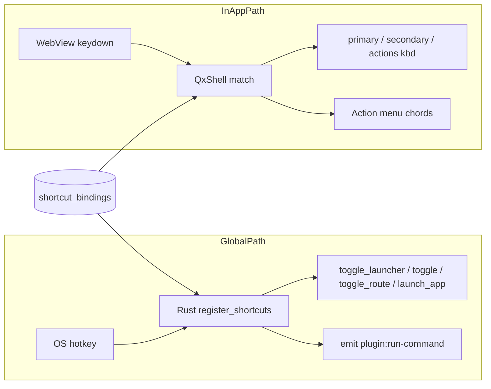

# 快捷键统一注册表（Global vs In-App）

| 字段 | 值 |
|---|---|
| **Status** | Design |
| **Date** | 2026-07-15 |
| **Related** | `docs/shell-and-shortcuts.md`、`ShortcutSettings.tsx`、`utils/keyboard.ts`、`plugin/registry.ts` |

---

## 1. 问题：不能「一把梭」

当前快捷键来源至少四条线：

| 来源 | 是否全局 | 注册方 | 用户可改？ | 现状 |
|---|---|---|---|---|
| `settings.shortcuts`（Launcher / 窗口 / 剪贴板 / RSS / 录屏） | **全局** | Rust `register_shortcuts` | 有 UI（但 Shortcuts 页未挂导航） | 硬编码 id |
| `settings.app_shortcuts` | **全局** | Rust | 结果项右键 | 未进 Shortcuts 汇总 |
| 插件 `manifest.shortcuts` | **全局** | 前端 `plugin-global-shortcut` | 扩展卡只读/半残 | 与 Rust `unregister_all` 会打架 |
| 模块 `actions[].kbd` / Shell `Cmd+K` | **应用内** | `QxShell` `matchesQxShortcut` | 代码写死 | 不进设置 |

若把所有 `kbd` 都当成「全局热键」进设置：

1. 会把 `Cmd+C` / `Enter` 注册成系统级 → 抢系统粘贴、抢编辑框。
2. 冲突检测错误（应用内只与本窗抢，全局与 OS/其它 App 抢）。
3. 外接模组无法声明「只在本模块内有效」。

**结论：设置里汇总为一页，但数据模型与执行路径必须按 scope 分叉。**

---

## 2. 两类 scope（硬分界）

```text
scope: "global"     → OS 级热键；Qx 隐藏也生效；Rust（或统一 host）注册
scope: "in_app"     → 仅主窗 key window 且匹配上下文时；WebView keydown
```

| 维度 | `global` | `in_app` |
|---|---|---|
| 生效条件 | 进程存活即可 | 主窗可见 + 成为 key window + 非编辑抢键（或 action menu 打开） |
| 注册 API | `tauri-plugin-global-shortcut` | 不注册 OS 热键；读 settings → 匹配 `KeyboardEvent` |
| 默认策略 | **默认关**（仅 `toggle_window` 默认开） | 可默认开（如 Actions Menu） |
| 推荐修饰键 | `Alt`/`Option` + 键 | `Cmd`/`Ctrl` + 键（Primary） |
| 禁止 | OS 保留（`Cmd/Ctrl+Space`）；慎用 `Cmd/Ctrl+V` | **禁止**绑定全局召唤键（`Alt+Space` 等 `isReservedGlobalShortcut`） |
| 冲突池 | 所有 global 键 **全集互斥** | 同 context 内互斥；可与 global 同物理键（不推荐但允许不同 scope） |
| 外接模组 | 需 permission `shortcut.global`；default deny | 需 `shortcut.in_app` 或随 action 声明；仅当前插件视图/命令 |

> **冲突池原则**：`global` 与 `in_app` **不共用同一冲突集合**。  
> UI 可提示「此键已用作全局热键」，但不自动判 invalid（用户可能故意 overlay）。

---

## 3. 统一条目模型

```ts
/** 稳定 id，带命名空间，永不靠显示名 */
// host.toggle_launcher
// host.toggle_window
// module.open.clipboard
// module.open.rss
// module.capture.screenshot      // current id: capture_screenshot
// module.capture.recording       // legacy id: record_gif
// module.capture.controls        // current id: toggle_capture_controls
// plugin.<pluginId>.cmd.<commandName>
// app.launch.<hashOrPathKey>
// shell.action_menu              // in_app
// module.clipboard.action.pin    // in_app（可选 v1.1）

export type ShortcutScope = "global" | "in_app";

export type ShortcutKind =
  | "host_toggle_launcher"
  | "host_toggle_window"
  | "open_module"           // global → toggle_route
  | "run_plugin_command"    // global or in_app
  | "launch_app"            // global only
  | "shell_chord"           // in_app only (action menu, etc.)
  | "module_action";        // in_app only

export interface ShortcutActionDef {
  id: string;
  scope: ShortcutScope;
  kind: ShortcutKind;
  /** UI 分组：host | modules | extensions | apps | shell */
  group: string;
  titleKey: string;
  titleFallback: string;
  descKey?: string;
  descFallback?: string;
  defaultKey: string;
  defaultEnabled: boolean;
  /** open_module */
  route?: string;
  /** plugin */
  pluginId?: string;
  command?: string;
  /** launch_app */
  appPath?: string;
  /**
   * in_app only: when this chord is active.
   * "shell" | "launcher" | `module:<id>` | `plugin:<id>` | "action_menu"
   */
  context?: string[];
  /** source of the definition (listing) */
  source: "builtin" | "plugin" | "user";
  rebindable: boolean;
  /** app shortcuts can be removed */
  removable?: boolean;
}
```

用户绑定（持久化）：

```ts
// settings.shortcut_bindings[id]  — 新表；或继续复用 shortcuts + 命名空间迁移
interface ShortcutBinding {
  key: string;
  enabled: boolean;
}
```

兼容旧键：

| legacy id | 新 id | scope |
|---|---|---|
| `toggle_launcher` | `host.toggle_launcher` | global |
| `toggle_window` | `host.toggle_window` | global |
| `clipboard` | `module.open.clipboard` | global |
| `rss` | `module.open.rss` | global |
| `capture_screenshot` | `module.capture.screenshot` | global |
| `record_gif` | `module.capture.recording` | global |
| `toggle_capture_controls` | `module.capture.controls` | global |
| `app_shortcuts["app:…"]` | 同 id 或 `app.launch.…` | global |

读 settings 时 **双读** legacy + namespaced；写时写 namespaced（可选同时写 legacy 一版迁移）。

---

## 4. 设置 UI：一页、分栏、分校验

**位置**：Settings → **Core → Shortcuts**（独立 tab，唯一汇总入口）。

Extensions 详情卡里的 Shortcuts **只做跳转**到本页并 filter=`plugin:<id>`，不再维护第二套编辑器。

### 4.1 页面结构

```text
┌ Shortcuts ─────────────────────────────────────────┐
│ [ 全部 | 全局热键 | 应用内 ]   🔍 搜索              │
│                                                     │
│ ▸ 全局 · 召唤与窗口                                 │
│   切换 Launcher 搜索     [开] [⌥Space] [↺]   GLOBAL │
│   切换当前窗口           [关] [⌥⇧Space] [↺]  GLOBAL │
│                                                     │
│ ▸ 全局 · 打开模块                                   │
│   剪贴板                 [关] [⌥V] …         GLOBAL │
│   RSS / 录屏 / …                                    │
│                                                     │
│ ▸ 全局 · 扩展命令          ← 已装插件动态贡献        │
│   Word Counter › Count   [关] [—] …          GLOBAL │
│                                                     │
│ ▸ 全局 · 启动 App          ← app_shortcuts          │
│   Safari                 [开] [⌥S] [删除]    GLOBAL │
│                                                     │
│ ▸ 应用内 · Shell                                    │
│   Actions 菜单           [开] [⌘K] …         IN-APP │
│                                                     │
│ ▸ 应用内 · 模块动作（v1.1，可选）                    │
│   剪贴板 › 置顶          [开] [⌘P] …         IN-APP │
└─────────────────────────────────────────────────────┘
```

每行右侧 **scope 徽章**（`GLOBAL` / `IN-APP`）不可省略，避免用户误以为 `⌘C` 会全局生效。

### 4.2 校验规则（按 scope）

```ts
function validateBinding(def: ShortcutActionDef, key: string, pool: BindingPool): Issue | null {
  if (def.scope === "global") {
    if (isOsReservedGlobal(key)) return "reserved";      // Cmd/Ctrl+Space
    if (conflictsInGlobalPool(key, pool.global)) return "conflict";
    // soft-warn: Cmd/Ctrl+V as global
    return null;
  }
  // in_app
  if (isReservedGlobalShortcut(key)) return "reserved"; // 禁止绑 Alt+Space 等到 in-app
  if (conflictsInSameContext(key, def.context, pool.inApp)) return "conflict";
  return null;
}
```

Recorder：

- **global**：沿用现 `ShortcutRecorder`（要求修饰键，面向系统热键）。
- **in_app**：允许 `CmdOrCtrl+Letter`、功能键；**拒绝**纯字母（避免输入框劫持）；拒绝 global-reserved。

---

## 5. 执行路径（绝不能串）



### 5.1 Global

- **唯一注册权**：Rust（推荐）。`unregister_all` 后只由 Rust 重装全部 global，包括：
  - host / module.open
  - app.launch
  - plugin 命令（emit `plugin:run-command` 或等价，前端执行）
- 前端 **禁止**再 `register()` 插件热键（迁完后删除 `plugin/registry.ts` 内 global register）。
- 模块禁用（`builtin_modules`）→ 对应 `module.open.*` 不注册。
- 插件卸载 → 贡献条目从列表消失；绑定可留在 settings（再装恢复）或 GC。

### 5.2 In-App

- **不**走 global-shortcut。
- `QxShell` / 模块在构造 `actions` 时：

```ts
const pinKbd = resolveInAppBinding("module.clipboard.action.pin") ?? "CmdOrCtrl+P";
```

- 匹配仍用 `matchesQxShortcut` + `shouldIgnoreBareShortcut` / 编辑焦点保护。
- Esc 协议不变：`escapeAction` 独占 Esc，**永不**进入可配置 action kbd。

### 5.3 插件声明（外接模组）

manifest 扩展（向后兼容现有 `shortcuts[]`）：

```json
{
  "shortcuts": [
    {
      "command": "count",
      "key": "Alt+W",
      "enabled": false,
      "scope": "global"
    },
    {
      "command": "count",
      "key": "CmdOrCtrl+Shift+C",
      "scope": "in_app",
      "context": ["plugin:word-counter"]
    }
  ]
}
```

规则：

| 字段 | 说明 |
|---|---|
| `scope` 缺省 | 视为 **`global`**（兼容现网 manifest） |
| `enabled` 缺省 | global → **false**（opt-in）；in_app 可 true |
| `key` | 默认建议键；用户覆盖写 settings，不改 manifest |
| permission | global 需要 `shortcut.global`；无权限则仅 in_app 或完全忽略 |
| 文案长度 / 频率 | 与 island 类似：global 插件热键每插件上限 N（建议 3） |

贡献进注册表：

```ts
// 插件 load 时
shortcutRegistry.contributeFromPlugin(plugin.manifest);
// 卸载
shortcutRegistry.revokePlugin(plugin.id);
```

Settings 页 `useSyncExternalStore(shortcutRegistry.subscribe)` 动态刷新，**无需**改 ShortcutSettings 硬编码列表。

---

## 6. 内置目录（v1 先落地这些）

### Global（可配置、进设置）

| id | 行为 |
|---|---|
| `host.toggle_launcher` | 显 Launcher + 聚焦搜索 / 再按隐藏 |
| `host.toggle_window` | 纯显隐 |
| `module.open.clipboard` 等 | `toggle_route` |
| `plugin.*.cmd.*` | 运行插件命令（show + run） |
| `app.launch.*` | 启动本机 App |

### In-App（v1 最小集）

| id | 默认 | 说明 |
|---|---|---|
| `shell.action_menu` | `CmdOrCtrl+K` | 各模块 secondary Actions；**真正可配置的应用内壳层键** |

v1 **不**把每个模块的 `Cmd+C`/`Cmd+P` 全暴露到设置（数量爆炸、上下文强绑定）。  
v1.1 可选：模块通过 `registerModuleActions()` 声明「可重绑」的 subset。

模块内写死的导航键（↑↓、Enter 打开、Esc）保持协议，**不可配置**（与 UI_SPEC Esc 协议一致）。

---

## 7. 与现有代码的映射

| 现有 | 归类 | 迁移 |
|---|---|---|
| `settings.shortcuts` | global | 保留 map；id 渐进 namespaced |
| `settings.app_shortcuts` | global | 可并入同一 map，或 Settings 一页两 section 仍分字段 |
| `plugin.manifest.shortcuts` | global（默认） | 默认键 + 用户 override；注册收归 Rust |
| `actions[].kbd` | in_app | v1 多数只读展示；`shell.action_menu` 可写 |
| `isReservedGlobalShortcut` | 护栏 | global 禁止 OS 键；in_app 禁止「本应用全局召唤键」 |
| `countEnabledGlobalShortcuts` | 冲突 | 只扫 `scope===global` 的 enabled 绑定 |

---

## 8. 外接模组兼容清单

1. **声明式贡献**：manifest / runtime `contributeShortcuts(defs)`，禁止模组自己 `register` OS 热键。  
2. **scope 必填或可推断**；错误 scope（如 in_app 却要求隐藏时触发）在加载时 dev warn 并降级。  
3. **用户覆盖优先于 manifest**；卸载插件不删用户绑定（或设置「清理已卸载扩展的快捷键」）。  
4. **权限**：`shortcut.global` default deny；`shortcut.in_app` 可随插件 UI 默认允许。  
5. **Settings 单页发现**：安装新扩展后无需改 Qx 源码，列表自动多一组。  
6. **禁用模块 / 禁用扩展**：对应条目灰显 + 不注册。

---

## 9. 分阶段落地

| 阶段 | 内容 |
|---|---|
| **P0** | Settings 挂上 Shortcuts tab；UI 分 GLOBAL / IN-APP 徽章；仅编辑现有 global 绑定 + 列出 app_shortcuts |
| **P1** | `ShortcutActionDef` 注册表；内置 module.open 从 catalog 生成；插件 manifest 贡献列表 + 用户 override 存储 |
| **P2** | 插件 global 注册收归 Rust；前端去掉 `register()`；settings 变更只触发一处 rebind |
| **P3** | `shell.action_menu` 可配置；可选模块 in_app 动作重绑 |

---

## 10. 明确非目标

- 不把 Esc / 列表方向键做成可配置全局或应用内快捷键。  
- 不让 in_app 绑定在 Qx 隐藏时生效。  
- 不让插件在无 `shortcut.global` 时静默注册 OS 热键。  
- v1 不做「一条绑定同时 global+in_app」。

---

## 11. Key Decisions

1. **一页设置，两套 scope** — 同一导航入口，模型与冲突池分离。  
2. **Global 默认 opt-in**（除 Launcher 召唤）— 与现行为一致。  
3. **Global 注册单一所有者（Rust）** — 消灭 unregister_all 清掉插件键的问题。  
4. **In-app 走 Shell 匹配，不注册 OS 热键** — 保护编辑与系统快捷键。  
5. **外接模组只贡献定义，不自管注册** — 可发现、可覆盖、可回收。  
6. **徽章与筛选** — 用户永远看得见「全局 / 应用内」。  
