# Qx 用户指南

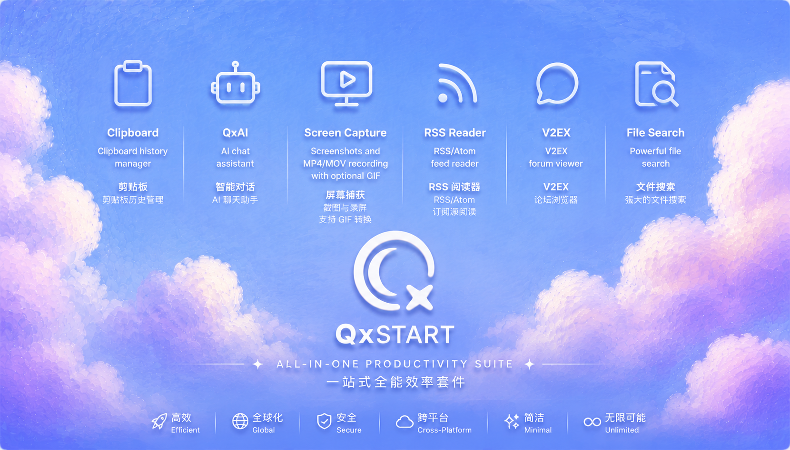

> **版本**：v0.6.64 · **适用平台**：macOS 14+ · Windows 10/11

**Qx** 是一款后台常驻的效率启动器，灵感来自 [Raycast](https://raycast.com)。按全局快捷键唤起，搜索应用、文件与命令；可选启用模块搜索后，还可检索剪贴板历史、RSS、AI 会话等，执行后再次隐藏。

***

## 目录

- [1. 安装](#1-安装)

- [2. 基础搜索](#2-基础搜索)

- [3. 搜索设置](#3-搜索设置)

- [4. 模块使用](#4-模块使用)

- [5. 模块设置](#5-模块设置)

- [6. 插件开发](#6-插件开发)

- [7. 存储管理](#7-存储管理)

***

## 1. 安装

### 苹果牌 电脑macOS（Homebrew，推荐）

```sh
brew tap mcxen/qx
brew install --cask qx
brew upgrade --cask qx   # 升级
```

### 苹果牌 电脑macOS（DMG）

1. 从 [GitHub Releases](https://github.com/mcxen/qx/releases) 下载 `.dmg`
2. 将 `Qx.app` 拖入"应用程序"
3. 首次启动如被 Gatekeeper 拦截：

```sh
xattr -dr com.apple.quarantine /Applications/Qx.app
```

DMG 内附 `install.sh`，也可直接运行 `bash install.sh` 自动完成安装并移除隔离标记。

### Windows系统电脑

- 点击安装：[快速下载地址](https://lz.qaiu.top/d/lz/ioxct3ytrnyb)

- 安装后一路确认即可，然后按住shift+ alt + space空格启动界面

> 首次启动与权限（macOS）
>
> 首次启动时 Qx 会引导完成必要的系统权限设置：
>
> 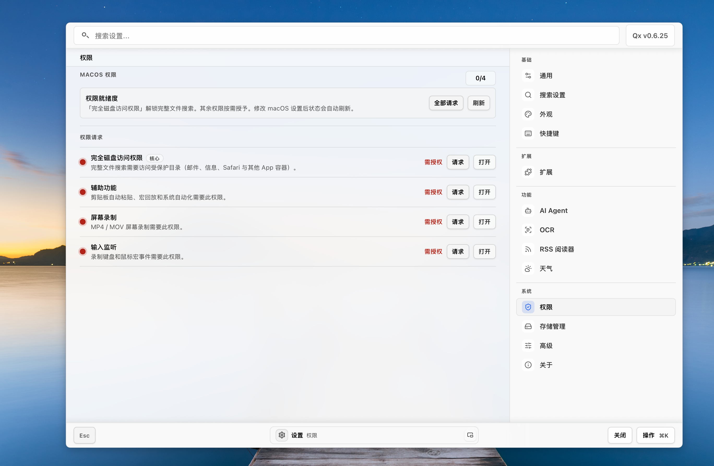
>
> | 权限           | 用途                                | 是否必须 |
> | ------------ | --------------------------------- | ---- |
> | **完全磁盘访问权限** | 文件搜索（遍历 Documents/Desktop 等受保护目录） | 推荐   |
> | **辅助功能**     | 剪贴板自动粘贴、宏回放                       | 可选   |
> | **屏幕录制**     | 截图与录屏功能                           | 可选   |
> | **输入监听**     | 录制键盘/鼠标宏、全局快捷键                    | 可选   |
>
> > 权限可跳过，不影响 Qx 启动。后续可在 **设置 -> 权限** 中重新运行权限向导。

### 默认快捷键

| 功能         | macOS          | Windows          |
| ---------- | -------------- | ---------------- |
| 唤起 / 隐藏 Qx | `Option+Space` | `Ctrl+Alt+Space` |
| 打开操作菜单     | `Cmd+K`        | `Ctrl+K`         |
| 打开设置       | `Cmd+,`        | `Ctrl+,`         |

界面内导航：

| 操作     | 快捷键                   |
| ------ | --------------------- |
| 上下选择   | `Up` / `Down`         |
| 执行选中项  | `Enter`               |
| 左右切换区域 | `Left` / `Right`      |
| 翻页     | `PageUp` / `PageDown` |
| 跳转首尾   | `Home` / `End`        |
| 逐级返回   | `Esc`                 |

***

## 2. 基础搜索

Qx 启动后，按 `Option+Space`（macOS）或 `Ctrl+Alt+Space`（Windows）唤起搜索界面。

### 界面结构

Qx 采用三层布局：

```
+----------------------------------------------+
| 顶部栏：搜索框 + 筛选 / 操作按钮              |
+----------------------------------------------+
| 主区域：搜索结果 / 模块内容 / 详情            |
+----------------------------------------------+
| 底部栏：Esc 返回 + 灵动岛 + 主要操作          |
+----------------------------------------------+
```

### 搜索应用与文件

在搜索框输入关键词，Qx 会搜索应用、文件与命令；若已开启「模块搜索」，还会附带模块内容：


- **应用**：匹配已安装的 macOS / Windows 应用

- **文件**：匹配本地文件和文件夹（需授予完全磁盘访问权限）

- **命令**：内置计算、文本处理等命令

- **模块结果**（**默认关闭**）：剪贴板历史、RSS 订阅、AI 会话等。新装不会在主搜里混入这些结果，避免干扰；需要时在 **设置 → 搜索设置** 打开总开关，并按模块勾选

搜索结果按类型分组显示，每组内按相关性排序：

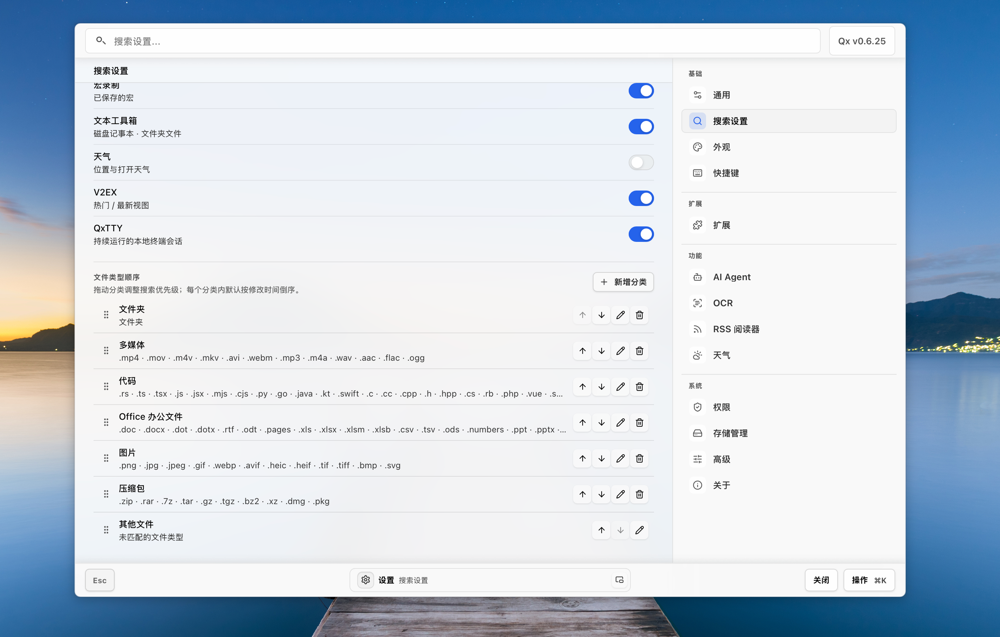

### 快捷入口（主页）

搜索框为空时，主区域上方会显示 **快捷入口**。新装默认包括：

| 入口 | 作用 |
| ---- | ---- |
| 剪贴板历史 | 打开剪贴板模块 |
| 截图与录屏 | 打开屏幕捕获模块 |
| 文本工具 | 打开文本工具箱 |
| **扩展 / 插件** | **直接进入 设置 → 扩展**（安装、更新、管理市场插件） |
| Qx 设置 | 打开设置（通用/外观等） |

可在主页「编辑快速入口」中增删排序。托盘菜单也会列出已启用的快捷入口。

### 快速操作

选中搜索结果后：

- `Enter` -- 执行主操作（打开应用、打开文件、执行命令）

- `Cmd+K` / `Ctrl+K` -- 打开操作菜单，查看更多可用操作

- `Left` / `Right` -- 在左侧列表与右侧详情/上下文面板间切换

### 内置快捷命令

搜索框支持直接输入：

- **计算器**：输入数学表达式（如 `2+3*4`），结果可直接复制

- **文本工具**：JSON 格式化、Markdown 转换等

- **系统命令**：打开设置、清空废纸篓等

***

## 3. 搜索设置

进入 **设置 -> 搜索设置**，控制搜索行为和结果分组。

### 启用模块搜索

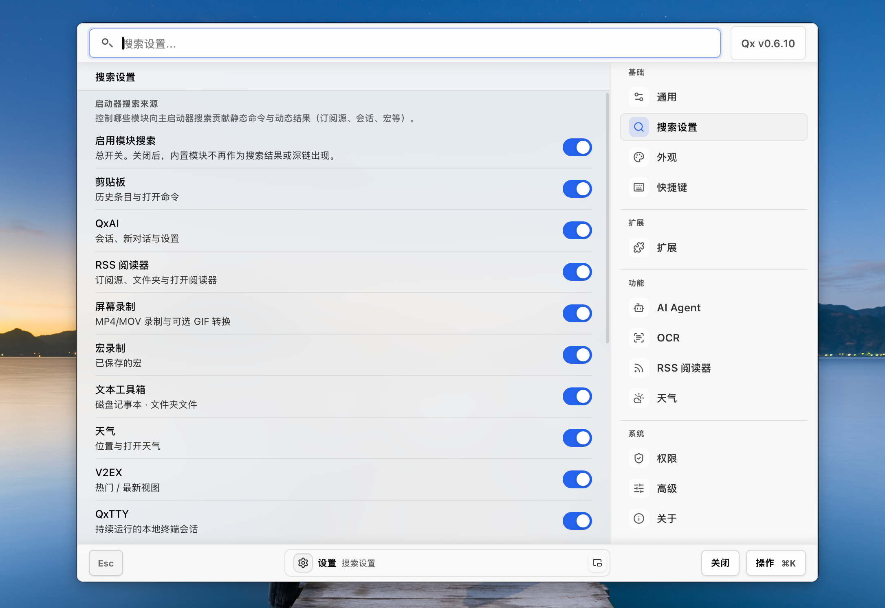

顶部有 **"启用模块搜索"** 总开关。

| 状态 | 行为 |
| ---- | ---- |
| **默认关闭**（新装 / 恢复默认） | 主启动器**不会**出现剪贴板历史、RSS、会话等模块结果，搜索保持以应用 / 文件 / 命令为主 |
| 开启总开关 | 下方勾选的模块才会向主搜贡献结果与深链 |
| 某模块单独关闭 | 仅该模块不出现在主搜；模块本体、快捷入口与快捷键不受影响 |

各模块独立开关（总开关打开后才生效；子项默认勾选，打开总开关即可用）：

| 模块      | 提供的搜索结果            |
| ------- | ------------------ |
| 剪贴板     | 历史条目与打开命令          |
| QxAI    | 会话、新对话与设置          |
| RSS 阅读器 | 订阅源、文件夹与打开阅读器      |
| 屏幕录制    | MP4/MOV 录制与 GIF 转换 |
| 宏录制     | 已保存的宏              |
| 文本工具箱   | 磁盘记事本、文件夹文件        |
| 天气      | 位置与打开天气            |
| V2EX    | 热门 / 最新视图          |
| QxTTY   | 持续运行的本地终端会话        |

> 关闭某个模块的搜索不影响在模块内部浏览和使用，仅影响主启动器的搜索结果。已从设置里手动打开过总开关的用户，升级后会保留自己的选择。

### 文件结果分组

在搜索设置页面可以自定义文件结果的分组排序：

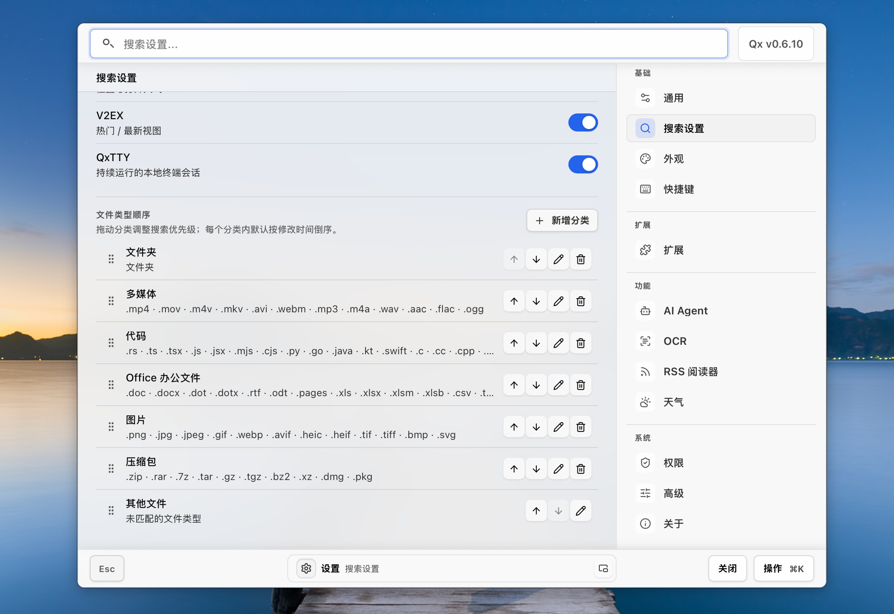

预设分组包括：文件夹、多媒体、代码、Office 办公文件、图片、压缩包、其他文件。

- 每组可通过上下箭头调整搜索结果中的显示优先级

- 支持新增自定义分类

- 可编辑或删除现有分组

***

## 4. 模块使用

Qx 内置多种功能模块，按 `Option+Space` 唤起后可通过搜索或快捷方式访问。

### 全部功能概览

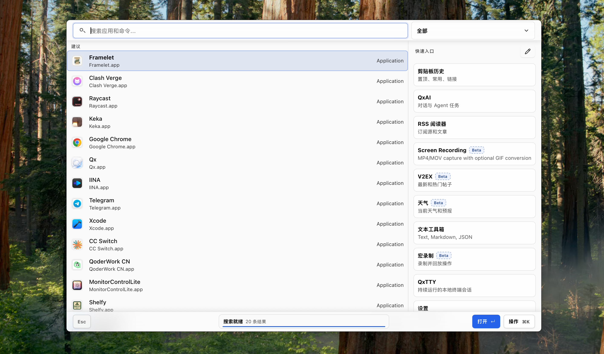

### 剪贴板历史

按 `Option+V`（默认）或搜索"剪贴板"打开。

- 自动记录文本、图片、文件路径

- 支持置顶常用条目

- 选中条目后 `Enter` 粘贴到当前光标位置

- 支持搜索剪贴板内容

### 截图与录屏

按 `Option+S` 截图、`Option+G` 录屏（默认快捷键）。

- 截图：区域选择后自动保存，支持标注；选区确认后 **⌘C / Ctrl+C** 直接复制到剪贴板并隐藏圈选框与 Qx，便于继续粘贴

- 录屏：区域 / 全屏录制为 MP4/MOV

- 录制完成后可在灵动岛中停止和管理

- 支持转换为 GIF

### RSS 阅读器

按 `Option+R`（默认）或搜索"RSS"打开。


- 支持添加 RSS/Atom 订阅源

- 文件夹分类管理

- OPML 导入 / 导出

- 应用内阅读全文，支持图片和排版

- 右侧上下文面板提供收藏、标记已读、浏览器打开等操作

### QxAI 对话

搜索"QxAI"或"AI"打开。

- 支持流式对话

- 可配置多个 AI 提供商（OpenRouter、DeepSeek、自定义 API）

- 支持 Agent 任务，支持配置bash工具，使用ReAct思维链，处理简单电脑问题

- 会话历史保存与搜索


### V2EX 社区

搜索"V2EX"打开。

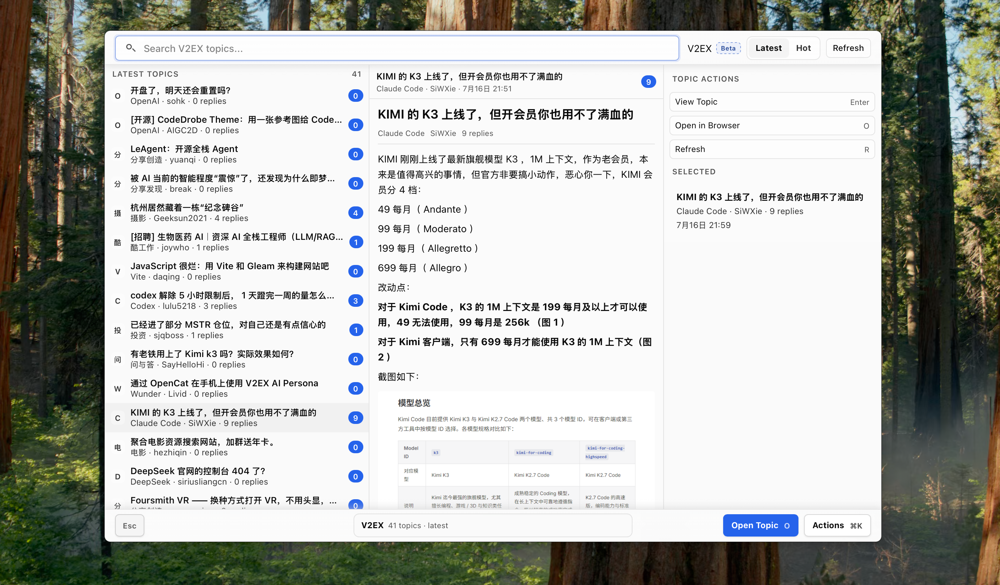

- 浏览 V2EX 热门 / 最新话题

- 查看话题详情和回复

- 支持图片查看

### 天气

搜索"天气"打开，显示当前位置天气信息。

### 屏幕录制

搜索"屏幕录制"或使用快捷键 `Option+G` 开始录制。录制过程中底部灵动岛显示录制状态和时长，支持暂停和停止。

### 文本工具箱

搜索"文本"或"工具"，提供：

- JSON 格式化 / 压缩

- Markdown 转换

- 文本编码 / 解码

- 磁盘记事本

### OCR 文字识别

搜索"OCR"打开文字识别功能。

### QxTTY 终端

搜索"终端"或"QxTTY"，提供持续运行的本地终端会话。

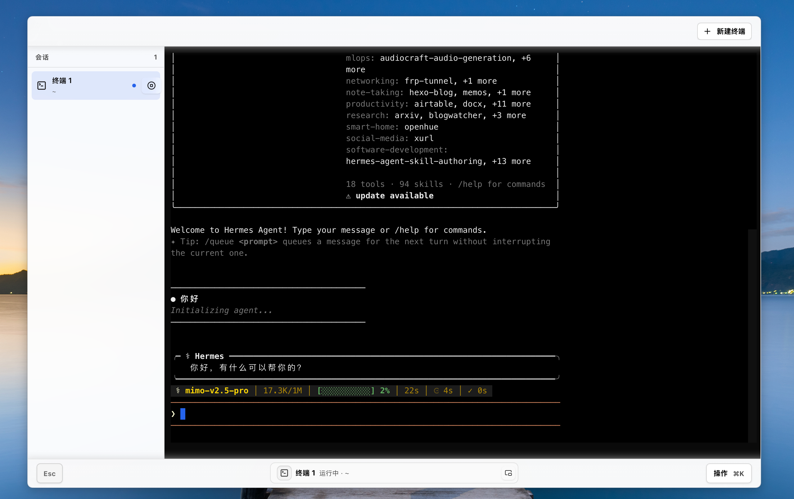

***

## 5. 模块设置

### 外观设置

进入 **设置 -> 外观**：

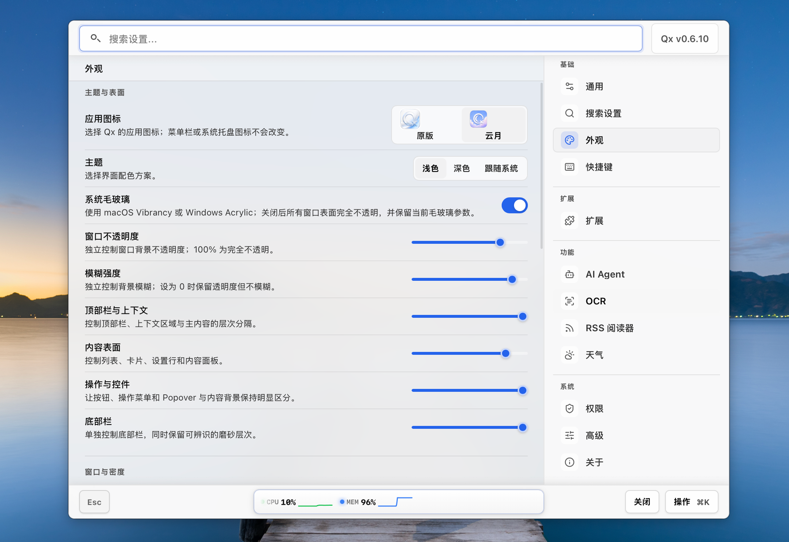

| 设置项         | 说明              |
| ----------- | --------------- |
| **应用图标**    | 原版 / 云月 两种图标可选  |
| **主题**      | 浅色 / 深色 / 跟随系统  |
| **系统毛玻璃**   | 开启后窗口背景使用系统磨砂效果 |
| **窗口不透明度**  | 5% \~ 100% 调节   |
| **模糊强度**    | 0 \~ 30px 磨砂半径  |
| **顶部栏与上下文** | 顶栏和侧栏的不透明度      |
| **内容表面**    | 内容区域的不透明度       |
| **操作与控件**   | 按钮、菜单等控件的不透明度   |
| **底部栏**     | 底栏的不透明度         |

#### 主页灵动岛

搜索框为空时，窗口底部会显示 **主页灵动岛**（系统状态、日期等卡片，可多选轮播）。在 **设置 → 外观 → 主页灵动岛** 中选择要展示的内容。

#### 桌面悬浮灵动岛

| 设置项 | 说明 |
| --- | --- |
| **启用悬浮灵动岛** | **默认开启**。允许从窗口底部灵动岛 **手动** 浮出到桌面并拖动位置；**不会**自动弹出 |
| **模块轮播** | 浮出后多个模块 / 插件状态按间隔轮播；任务与错误会立即抢占 |
| **Qx 隐藏时显示** | 仅对已经手动浮出的岛生效；主窗口隐藏后仍可保留 |
| **始终置顶** | 紧凑岛保持在普通应用窗口上方 |

安装后即可使用：唤起 Qx → 在底部灵动岛操作浮出。若关闭总开关，浮出能力与相关选项会禁用，可随时在设置中重新打开。

### 快捷键设置

进入 **设置 -> 快捷键**：

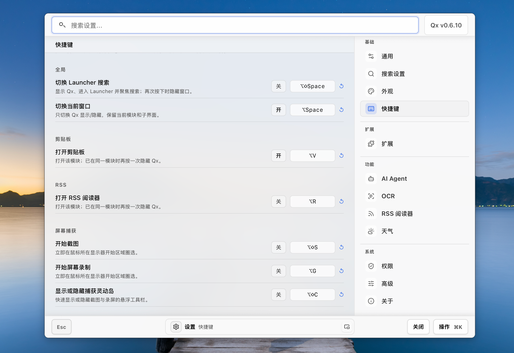

支持自定义以下快捷键：

**全局**

- 切换 Launcher 搜索（默认 `Option+Space`）

- 切换当前窗口（仅隐藏 / 显示当前模块）

**剪贴板**

- 打开剪贴板（默认 `Option+V`）

**RSS**

- 打开 RSS 阅读器（默认 `Option+R`）

**屏幕捕获**

- 开始截图（默认 `Option+S`）

- 开始屏幕录制（默认 `Option+G`）

- 显示 / 隐藏捕获灵动岛（默认 `Option+C`）

点击快捷键行右侧的录制按钮，按下新的组合键即可修改。

### 权限管理

进入 **设置 -> 权限**，可查看和管理系统权限状态，重新运行权限向导。

### AI Agent 设置

进入 **设置 -> AI Agent**：

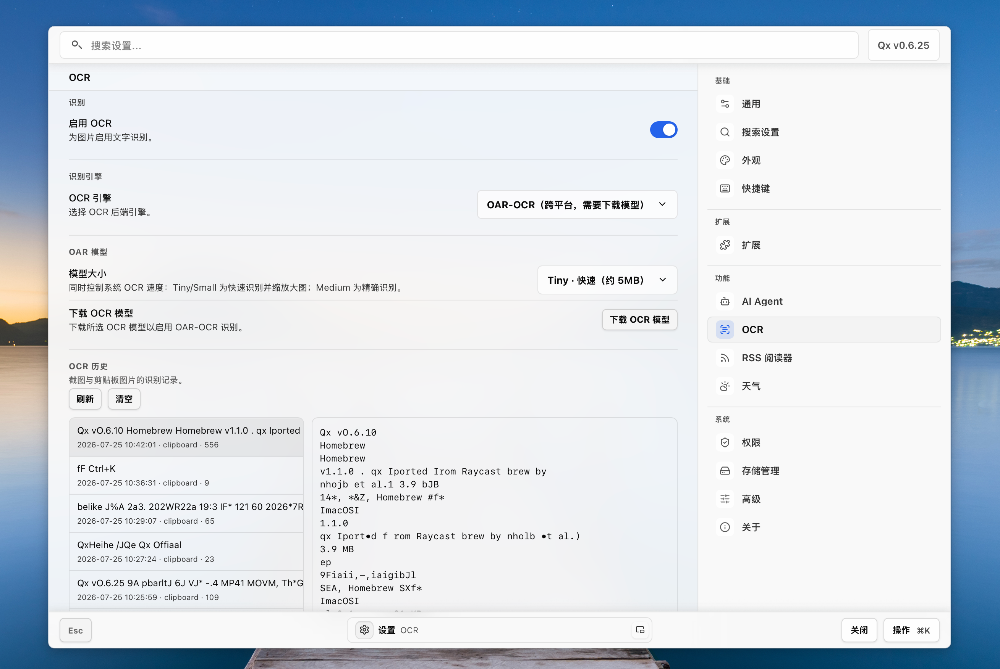

- **AI 提供商**：选择和配置 AI 后端

- **API Key**：填入各提供商的密钥

- **模型选择**：选择使用的模型

- **OCR 引擎**：选择识别引擎（如 OAR-OCR）、模型大小，可下载 OCR 模型

- **OCR 历史**：查看最近的截图和剪贴板识别记录

### 其他设置

- **通用**：开机自启、语言、**自动更新开关**（是否后台自动装）

- **高级**：诊断日志、开发者模式等

- **关于**：版本、**更新源**（CNB / GitHub / 自动）、检查与下载更新、发布页

- **搜索设置 → 模块搜索**：默认关闭；需要主搜剪贴板等内容时再打开（见 [§3](#3-搜索设置)）

- **外观 → 悬浮灵动岛**：默认开启，可手动浮到桌面（见上文）

***

## 6. 插件开发

Qx 支持通过插件扩展功能。插件运行在沙箱 iframe 中，通过稳定的 `context.*` 端口与宿主通信。

### 安装插件

#### 从市场安装

进入 **设置 -> 扩展 -> 浏览**：

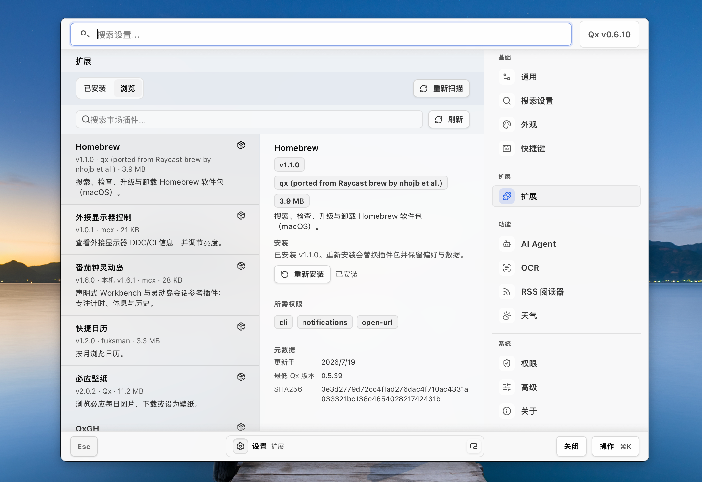

- 浏览可用插件，查看版本、权限和描述

- 点击"安装"即可一键安装

- 国内用户可配置镜像源（见下方源管理）

#### 本地安装

在 **设置 -> 扩展 -> 已安装** 中：

- 填入本地路径（如 `~/Downloads/my-plugin.qx-plugin`）-> **Install Local**

- 填入 GitHub / ZIP URL -> **Install URL**

#### 管理插件源

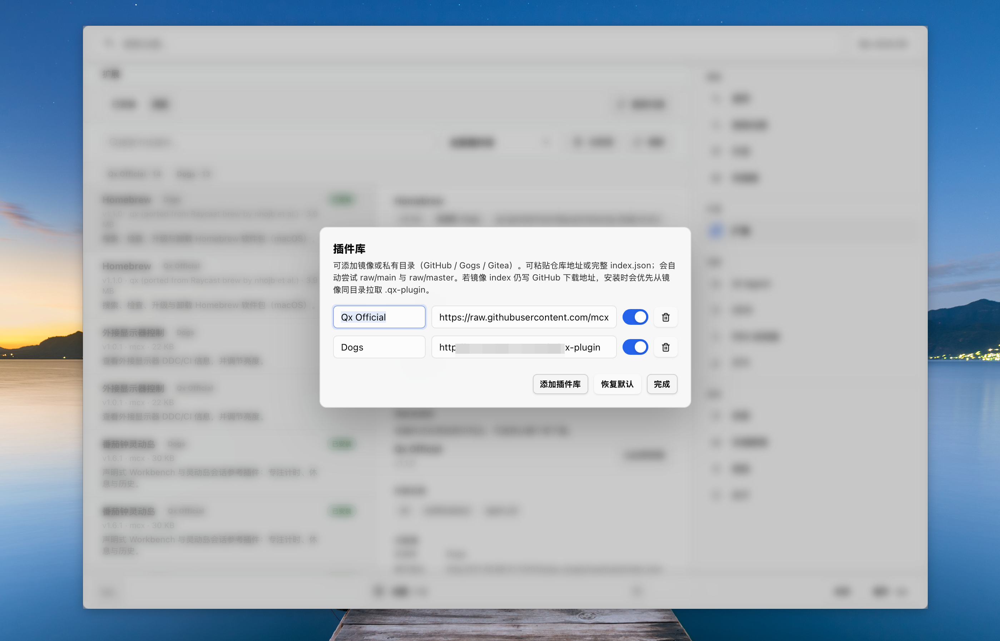

支持添加 GitHub、Gitee 或 Gitlab 的镜像或仓库目录：

- **Qx Official**：官方源

- **Dogs**：社区源

- 可自行添加 index.json 链接或仓库地址

- 支持启用 / 禁用 / 删除源

### 插件目录结构

开发时放在 `~/.qx/plugins/<id>/`：

```
~/.qx/plugins/<id>/
  manifest.json      # 插件清单：id、权限、命令、面板
  index.js           # 宿主加载的 ESM 入口
  icon.png           # 图标（可选）
  README.md          # 说明（可选）
  data/              # 运行时生成的存储数据
```

### manifest.json 示例

```json
{
  "id": "my-plugin",
  "name": "My Plugin",
  "version": "1.0.0",
  "description": "A sample plugin",
  "permissions": ["cli", "http"],
  "commands": [
    {
      "name": "Run",
      "mode": "list"
    }
  ]
}
```

### 插件运行模型

```
+-----------------------------------------------------+
|  Launcher 搜索 / Extensions 安装 / Panel 窗口        |  宿主 UI
+-------------------------+---------------------------+
                          | postMessage RPC
+-------------------------v---------------------------+
|  插件 iframe：index.js                                |  你的代码
|  只依赖 context.* 端口，不碰 OS / 文件路径细节         |
+-------------------------+---------------------------+
                          | permissions 白名单
+-------------------------v---------------------------+
|  Rust 能力：cli / http / storage / clipboard / ai    |  宿主实现
+-----------------------------------------------------+
```

核心原则：

- **端口优先**：业务只调 `context.cli` / `context.http` / `context.storage` 等稳定端口

- **权限显式**：必须在 `manifest.permissions` 声明所用能力

- **沙箱**：没有裸 `child_process`，没有任意 `file://`

- **可分发**：一个 zip（`.qx-plugin`）即可 Import 或上市场

### 打包与发布

```sh
cd ~/.qx/plugins/my-plugin
zip -r ~/Desktop/my-plugin.qx-plugin manifest.json index.js icon.png README.md
```

发布到 [mcxen/qx-plugins](https://github.com/mcxen/qx-plugins) 市场仓库，提交 PR 即可。

> 详细开发文档见 [插件开发手册](../public/doc/plugin-development-guide.md)。

***

## 7. 存储管理

进入 **设置 -> 系统 -> 存储管理**，查看和管理 Qx 的磁盘占用。

### 存储概览

存储管理页面显示各模块的缓存占用情况：

- **宿主缓存**：内置模块产生的缓存数据

- **插件缓存**：插件通过 `cacheTargets[]` 声明的可重建缓存

- **剪贴板历史**：剪贴板数据库

- **RSS 数据**：订阅源和文章缓存

- **截图 / 录屏**：捕获文件和缩略图

### 清理缓存

- **逐模块清理**：点击模块右侧的清理按钮

- **清理全部模块缓存**：一键清除所有模块的缓存数据

> 清理缓存不会删除：剪贴板历史记录、已保存的宏、插件持久数据、用户设置和快捷键配置。

### 插件存储

插件可通过 `manifest.storage.cacheTargets[]` 声明可重建缓存：

- 每个缓存目标有稳定的 target id 和展示文案

- 可设置 `retentionDays` 自动过期

- 插件内部负责细粒度淘汰（如按 `readAt` 时间）

存储管理页面会统一显示宿主和插件的缓存，方便一站式管理。

***

## 快速参考

| 操作      | macOS          | Windows          |
| ------- | -------------- | ---------------- |
| 唤起 / 隐藏 | `Option+Space` | `Ctrl+Alt+Space` |
| 操作菜单    | `Cmd+K`        | `Ctrl+K`         |
| 设置      | `Cmd+,`        | `Ctrl+,`         |
| 剪贴板     | `Option+V`     | -                |
| RSS 阅读器 | `Option+R`     | -                |
| 截图      | `Option+S`     | -                |
| 录屏      | `Option+G`     | -                |
| 返回      | `Esc`          | `Esc`            |

## 获取帮助

- **设置**：Qx 内置设置界面（`Cmd+,`）

- **插件开发文档**：[public/doc/](../public/doc/)

- **GitHub**：[mcxen/qx](https://github.com/mcxen/qx)

- **社区**：GitHub Discussions Issue 或[X评论区](https://x.com/JulieRe18231389/status/2079571638027448746?s=20) 或用户群

-


## 许可证

Qx 使用 Qx Source-Available License v1.0：

- **个人 / 非商业**：可查看、学习、修改、运行

- **商业使用、再分发或 SaaS**：需要书面许可
